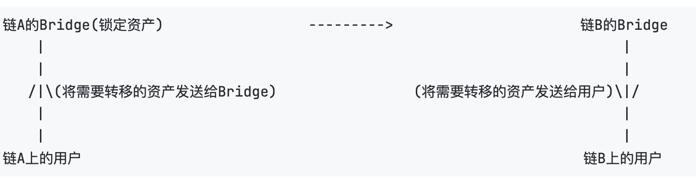
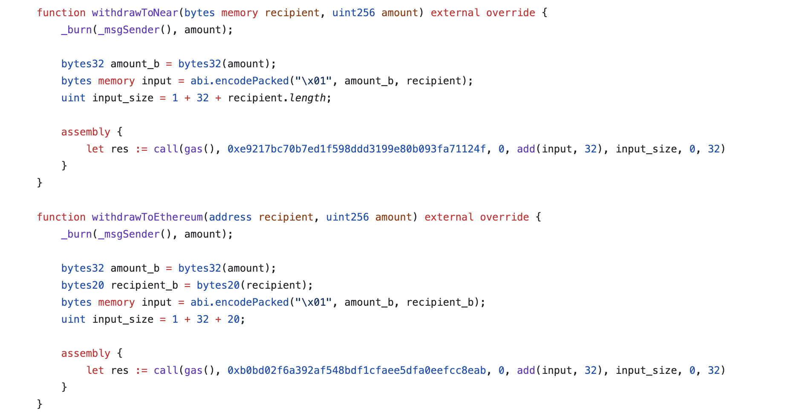
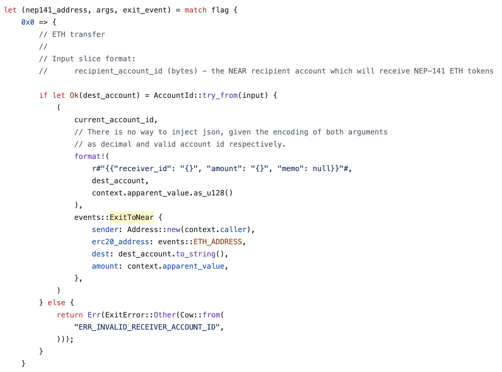
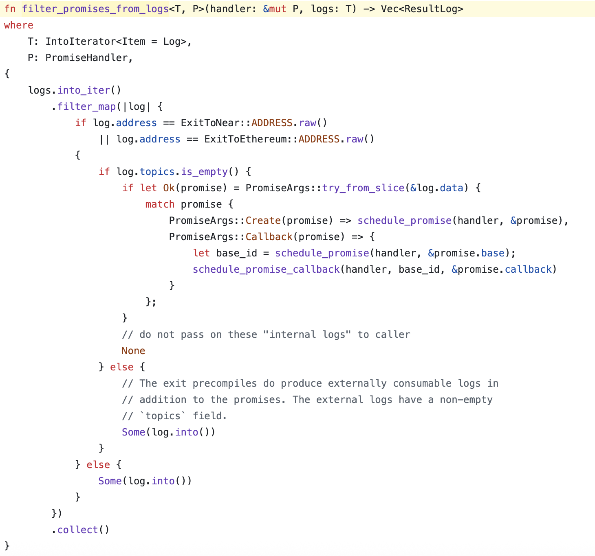
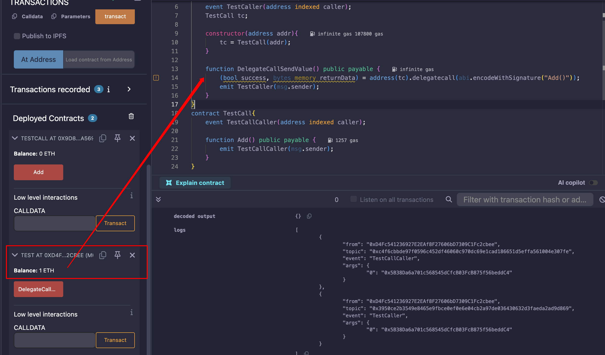

## 什么是Bridge

随着用户需要将资产放入DeFi，低手续费和区块的快速确认这些需求急剧增加，所以就有了L2拓展（L2 scaling solutions）和侧链技术（sidechains），然而这些解决方法不能互相操作和相互通信；

如果我们想将我们的ERC20或者ERC721代币从一个链上转移到另一个链上，该怎么搞？

所以这就有了Bridge，Bridge是一种方法，可以连接两个或更多的区块链，并且允许用户在其所支持的各种区块链之间转移资产；

Bridge没有标准的设计及实现方法，大部分的Bridge使用所谓的IOU（I OWE YOU）的方法，比如用户需要将一些资产从链A转移到链B，首先用户在链A将需要移动的资产发送给同在链A的Bridge合约，该Bridge合约将会把资产锁在其中，随后链B上Bridge合约将发送相同数量的资产给链B上的该用户；



对于从一条链上转移到另一条链上的每一份资产，Bridge必须在该链上持有该资产，为了后续用户可能需要将资产取回，所以Bridge中会有大量的资产存储；


## NEAR

` NEAR Protocol `是一个高性能的L1公链，采用PoS共识机制；


## Aurora和Rainbow Bridge

` Aurora `是建立在` NEAR `上的一个EVM兼容层（不是一个链，而是一个合约系统），核心组成是` Aurora Engine `（运行在NEAR上的高性能EVM）和` Aurora Bridge `（跨链桥，支持ETH及ERC20等代币在以太坊及Aurora之间转移）；

` Rainbow Bridge `是NEAR官方推出的一个去中心化、无需许可、无需信任的跨链桥协议，让用户可以在 Ethereum ↔ NEAR ↔ Aurora 之间转移资产；

当资产从` Ethereum `转入` NEAR `或` Aurora `时，原链资产被锁定，目标链上生成“映射资产”（如` nETH `、` wNEAR `）；


## Aurora的withdraw原理

` Aurora Engine `内置了两个预编译合约：

` ExitToNear `：把Aurora上的 ETH / ERC20 withdraw到NEAR网络上；

` ExitToEthereum `：把Aurora上的 ETH / ERC20 withdraw到Ethereum上；

### ERC20的withdraw

[EvmErc20.sol](https://github.com/aurora-is-near/aurora-engine/blob/5c8691ea6ea5f1b309ef227f7f5c719ffea45d28/etc/eth-contracts/contracts/EvmErc20.sol)



可以看到，先burn了要withdraw数目的ERC20代币，再调用内置合约，触发生成日志，Bridge监听到日志后放行资金，挺合理，杜绝了重放的可能性；


### ETH的withdraw

[native.rs](https://github.com/aurora-is-near/aurora-engine/blob/5c8691ea6ea5f1b309ef227f7f5c719ffea45d28/engine-precompiles/src/native.rs#L245)



可以看到，构造了一个三元组` (nep141_address, args, exit_event) `，分别代表要调用的NEAR合约地址、NEAR合约参数、EVM事件日志；

` nep141_address `:Aurora自己；

` args `:其中金额为context.apparent_value，也就是当前调用附带的数量；

` exit_event `:金额为当前调用附带的数量；

也就是，当提现ETH的时候，Aurora会将该笔调用中的ETH转账给指定的NEAR账户（也就是自己），并留下一条` ExitToNear `事件日志；

随后，会根据引擎[engine.rs](https://github.com/aurora-is-near/aurora-engine/blob/5c8691ea6ea5f1b309ef227f7f5c719ffea45d28/engine/src/engine.rs#L1293)的` filter_promises_from_logs `函数检查：



随后进行提款，看到其中的` if log.address == ExitToNear::ADDRESS.raw() || log.address == ExitToEthereum::ADDRESS.raw() `，**<u>只要该log的地址是预编译合约` ExitToNear(0xe9217bc70b7ed1f598ddd3199e80b093fa71124f) `或者是预编译合约` ExitToEthereum(0xb0bd02f6a392af548bdf1cfaee5dfa0eefcc8eab) `发出的，便会把promise通过handler排进NEAR的执行队列（也就是取款）</u>**；

### Withdraw流程

用户将需要提现到ETH发送到两个预编译合约（` ExitToNear `和` ExitToEthereum `），预编译合约会生成一个事件日志，记录提现的详细信息，然后NEAR网络会验证该事件（也就是漏洞点所在，只要该log到地址是预编译合约生成的，就通过），验证通过后会生成一个Proof，用户去Ethereum或者NEAR提交Proof，便能成功提现；


## Vulnerability

由于Withdraw ETH的时候只检查了日志的生成地址及携带的金额是否大于0，所以黑客想要利用，只需要使用某种方式携带一点ETH，让预编译的合约地址生成日志就行了；

可以使用` call `和` delegatecall `来直接执行withdraw函数，均可以让日志生成，但是由于还会检查附带的金额，` call `会真正把金额转过去，但是使用` delegatecall `再加上一个中转的合约就能实现无成本提取资产；

下面这个Test就能看出，Test合约` delegatecall `TestCall合约的` Add() `函数，并附带上1ETH的金额，资金只会被转移到Test合约，同时两者的` msg.sender `都是调用者；




### 攻击流程

1. 在Aurora上部署恶意合约；

```solidity
contract Exp{
    address payable public owner;
    // 两个预编译合约地址
    ExitToEthereum ete;
    ExitToNear etn;

    constructor(address toEth, address toNear){
        owner = msg.sender;
        ete = ExitToEthereum(toEth);
        etn = ExitToNear(toNear);
    }

    function exp() public payable {
        require(msg.sender == owner);
        // 编码提现函数
        bytes memory callData = abi.encodePacked("encode the withdraw function");
        // 让预编译合约生成日志
        (bool, _) = ete.delegatecall(callData);
        // 此时日志已经生成，并且附带的金额会在该合约中
        // 再将金额转走，owner中的金额会变双倍
        address(owner).transfer(msg.value);
    }
}
```

2. 使用owner账户从Ethereum使用` Rainbow Bridge `Bridge ETH到Aurora；

3. owner附带金额调用恶意合约，使预编译合约生成提款日志，但是owner在Aurora上的ETH还是没有减少的；

4. 此时owner在Ethereum上提现，再将提现的ETH Bridge到Aurora，owner在Aurora上的金额变成双倍；
5. 重复第3、4步，使资金无限的翻倍；

### 修复方法

Aurora引擎修改了预编译合约（`ExitToNear` 和 `ExitToEthereum`）的逻辑，增加了地址验证；

当合约被调用时，会检查调用地址是否与预定义的合约地址一致。如果不一致（例如通过`delegatecall`调用），则直接返回错误。


