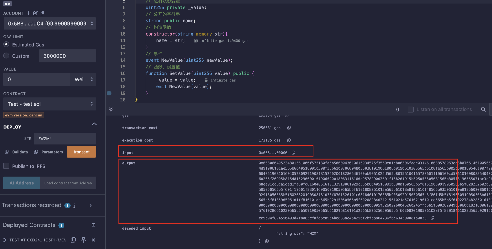

## 什么是EVM

以太坊是一个分布式的状态机，其中的状态不仅包含所有的账户和余额，还有EVM和EVM状态(可以被预先定义的规则所改变的东西);

EVM是以太坊中的虚拟机，可以允许不被信任的代码执行；它是一个基于栈的虚拟机，有一个短暂的内存和一个永久存储的状态；


` PC `：类似计算机中的PC寄存器，记录当前的指令执行到哪了；

` Stack `：栈，以太坊是基于栈的，深度是1024，每层256位（32字节，哈希长度是这么多）；

` Gas available `：可用的gas，每执行一条指令，gas便会相应的少一点；

` Memory `：内存；

` Virtual ROM `：存储代码的地方，不可变；

` World state `：存储状态的，永久存储，整个状态是一个"[modified Merkle Patricia Trie](https://ethereum.org/en/developers/docs/data-structures-and-encoding/patricia-merkle-trie/)"；


导致以太坊状态变化的是来自账户的交易（包括转账、调用合约等）；

以太坊的运行图：


## 4种Data Location

在了解EVM的opcode如何工作之前，需要先了解一下当你部署合约或者调用一个外部函数时，代码、数据都存在什么地方；

### Storage

` Storage `时存储状态变量的地方，永久存储。

存储的结构体可以被理解为一个` key-value `键值对，每个key和每个value的长度都是32字节(256比特):

```solidity
Key#(Slot)[256 bytes]    |    Value[256 bytes]
---------------------------------------------
0                        |    1111111
1                        |    22222222
2                        |    333333333
...
```

这里的key可以形象的理解为插槽(slot)，共有2^256个,序号为0 ~ 2^256-1，可以通过插槽的序号来读取数据;


### Memory

` memory `是代码执行时存储临时变量的地方，同时在` Solidity `中声明像array时必须加上这个关键词:

````solidity
uint256[] memory array = new uint256[](10);
````

可以被看作是一个字节数组，可以以1字节[8比特]或者32字节[256比特]的形式写入(各自有对应的opcode,` MSTORE8 `和` MSTORE `)，读取时都是32字节(有指定的opcode,` MLOAD `);


### Call Stack

EVM是一个基于栈的虚拟机，` call stack `就是基础，写合约你可以操控` storage `和` memory `，当合约在操纵这两个数据位置时，就需要` call stack `来提供帮助;

` call stack `就像x86中的栈一样，存储一些中间数据的;` opcode `可以从中pop数据接收，也可以push数据进去;

```solidity
// 例子
assembly{
        // opcodes
    PUSH1 0x05
    PUSH1 0x00
    SSTORE
};

call stack:
|      |     |      |     |      |
|      | --> |      | --> |      |
|      |     | 0x00 |     |      |
| 0x05 |     | 0x05 |     |      |(SSTORE指令需要接收2个参数,所以栈中没有数据来)
```

为什么不直接操作memory？--> 栈更加的高效和便宜(gas少);


### Calldata

` calldata `也是临时存在的，存储函数的调用参数，它只存在于外部函数调用，不能更改;

```solidity
// calldata例子
// 0x6057361d000000000000000000000000000000000000000000000000000000000000000a
```

一开始的4个字节` 6057361d `是函数选择器(函数名+参数取哈希)，后面是调用的实际参数；


## 字节码

### 字节码的组成

一个合约编译后的字节码由两个部分组成：

#### 初始化字节码

* 包含一些初始化一些状态的指令(合约的构造函数)
* 一些将运行时字节码拷贝给EVM的指令(部署)

在EVM接收运行时字节码后(存储在链上，并且关联了一个账户地址)，此时链上存储的才是真正的运行时字节码；

初始化字节码只会运行一次，是在部署期间，也可以称为部署合约；

#### 运行时字节码

在合约中写的一些变量、函数、事件都会被转化为由[EVM Opcodes](https://www.evm.codes/)组成的一连串的字节码；

当一个外部调用（会有一个calldata传来）来调用此合约的一个函数，合约会提取` calldata `的前4个字节（` 函数选择器 `），然后通过一连串的` if/else `匹配到正确的函数来执行；

### 调试方法及反编译

接下来看一个简单的合约：

```solidity
// SPDX-License-Identifier: MIT
pragma solidity ^0.8.26;

contract Test{
    // 私有状态变量
    uint256 private _value;
    // 公开的字符串
    string public name;
    // 构造函数
    constructor(string memory str){
        name = str;
    }
    // 事件
    event NewValue(uint256 newValue);
    // 函数，设置值
    function SetValue(uint256 value) public {
        _value = value;
        emit NewValue(value);
    }
}
```

部署：



#### 部署字节码和运行时字节码

` input `：包含了构造函数的部分、部署合约的部分和运行时字节码；

` output `：运行时字节码，最终会被写入区块链；

```solidity
// input,其中包裹着output,在其中用{output}表示的,其余部分是初始化字节码
// 0x608060405234801561000f575f80fd5b506040516107af3803806107af83398181016040528101906100319190610194565b806001908161004091906103e8565b50506104b7565b5f604051905090565b5f80fd5b5f80fd5b5f80fd5b5f80fd5b5f601f19601f8301169050919050565b7f4e487b71000000000000000000000000000000000000000000000000000000005f52604160045260245ffd5b6100a682610060565b810181811067ffffffffffffffff821117156100c5576100c4610070565b5b80604052505050565b5f6100d7610047565b90506100e3828261009d565b919050565b5f67ffffffffffffffff82111561010257610101610070565b5b61010b82610060565b9050602081019050919050565b8281835e5f83830152505050565b5f610138610133846100e8565b6100ce565b9050828152602081018484840111156101545761015361005c565b5b61015f848285610118565b509392505050565b5f82601f83011261017b5761017a610058565b5b815161018b848260208601610126565b91505092915050565b5f602082840312156101a9576101a8610050565b5b5f82015167ffffffffffffffff8111156101c6576101c5610054565b5b6101d284828501610167565b91505092915050565b5f81519050919050565b7f4e487b71000000000000000000000000000000000000000000000000000000005f52602260045260245ffd5b5f600282049050600182168061022957607f821691505b60208210810361023c5761023b6101e5565b5b50919050565b5f819050815f5260205f209050919050565b5f6020601f8301049050919050565b5f82821b905092915050565b5f6008830261029e7fffffffffffffffffffffffffffffffffffffffffffffffffffffffffffffffff82610263565b6102a88683610263565b95508019841693508086168417925050509392505050565b5f819050919050565b5f819050919050565b5f6102ec6102e76102e2846102c0565b6102c9565b6102c0565b9050919050565b5f819050919050565b610305836102d2565b610319610311826102f3565b84845461026f565b825550505050565b5f90565b61032d610321565b6103388184846102fc565b505050565b5b8181101561035b576103505f82610325565b60018101905061033e565b5050565b601f8211156103a05761037181610242565b61037a84610254565b81016020851015610389578190505b61039d61039585610254565b83018261033d565b50505b505050565b5f82821c905092915050565b5f6103c05f19846008026103a5565b1980831691505092915050565b5f6103d883836103b1565b9150826002028217905092915050565b6103f1826101db565b67ffffffffffffffff81111561040a57610409610070565b5b6104148254610212565b61041f82828561035f565b5f60209050601f831160018114610450575f841561043e578287015190505b61044885826103cd565b8655506104af565b601f19841661045e86610242565b5f5b8281101561048557848901518255600182019150602085019450602081019050610460565b868310156104a2578489015161049e601f8916826103b1565b8355505b6001600288020188555050505b505050505050565b6102eb806104c45f395ff3fe{output}00000000000000000000000000000000000000000000000000000000000000200000000000000000000000000000000000000000000000000000000000000003575a4d0000000000000000000000000000000000000000000000000000000000
```

```solidity
// output,运行时字节码
// 0x608060405234801561000f575f80fd5b5060043610610034575f3560e01c806306fdde0314610038578063ed8b070614610056575b5f80fd5b610040610072565b60405161004d91906101ae565b60405180910390f35b610070600480360381019061006b9190610205565b6100fe565b005b6001805461007f9061025d565b80601f01602080910402602001604051908101604052809291908181526020018280546100ab9061025d565b80156100f65780601f106100cd576101008083540402835291602001916100f6565b820191905f5260205f20905b8154815290600101906020018083116100d957829003601f168201915b505050505081565b805f819055507fac3e966f295f2d5312f973dc6d42f30a6dc1c1f76ab8ee91cc8ca5dad1fa60fd81604051610133919061029c565b60405180910390a150565b5f81519050919050565b5f82825260208201905092915050565b8281835e5f83830152505050565b5f601f19601f8301169050919050565b5f6101808261013e565b61018a8185610148565b935061019a818560208601610158565b6101a381610166565b840191505092915050565b5f6020820190508181035f8301526101c68184610176565b905092915050565b5f80fd5b5f819050919050565b6101e4816101d2565b81146101ee575f80fd5b50565b5f813590506101ff816101db565b92915050565b5f6020828403121561021a576102196101ce565b5b5f610227848285016101f1565b91505092915050565b7f4e487b71000000000000000000000000000000000000000000000000000000005f52602260045260245ffd5b5f600282049050600182168061027457607f821691505b60208210810361028757610286610230565b5b50919050565b610296816101d2565b82525050565b5f6020820190506102af5f83018461028d565b9291505056fea264697066735822122041b986fd46ce9b04f824550403d4f8083cfafa6e8954be833ae454250f2bfba864736f6c634300081a0033
```

#### 调试方法

之后便可以在页面中调试：


#### 反编译

有两个比较好用的网站：

https://ethervm.io/decompile

https://app.dedaub.com/decompile

##### 反编译` input `及解析

```solidity
function 0x3e8(uint256 varg0, bytes varg1) private { 
    require(varg1.length <= uint64.max, Panic(65)); // failed memory allocation (too much memory)
    // 读取Storage[1]的内容到v0
    v0 = STORAGE[varg0] >> 1;
    if (!(STORAGE[varg0] & 0x1)) {
        v0 = v1 = v0 & 0x7f;
    }
    require((STORAGE[varg0] & 0x1) - (v0 < 32), Panic(34)); // access to incorrectly encoded storage byte array
    // 若v0大于31字节,则将v2到v4点内容清零,还是初始化
    if (v0 > 31) {
        v2 = v3 = v4 + (varg1.length + 31 >> 5);
        while (v2 < v4 + (v0 + 31 >> 5)) {
            STORAGE[v2] = STORAGE[v2] & 0x0 | uint256(0);
            v2 = v2 + 1;
        }
    }
    v5 = v6 = 32;
    if (varg1.length > 31 == 1) {
            // 传过来的内容长度大于31,也就是大于等于32字节
        v7 = v8 = 0;
        while (v7 < varg1.length & 0xffffffffffffffffffffffffffffffffffffffffffffffffffffffffffffffe0) {
                // 一次取32字节存入
            STORAGE[v9] = MEM[varg1 + v5];
            v9 = v9 + 1;
            v5 = v5 + 32;
            v7 = v7 + 32;
        }
        if (varg1.length & 0xffffffffffffffffffffffffffffffffffffffffffffffffffffffffffffffe0 < varg1.length) {
            STORAGE[v9] = MEM[varg1 + v5] & ~(uint256.max >> ((varg1.length & 0x1f) << 3));
        }
        // 更新值的内容
        STORAGE[varg0] = (varg1.length << 1) + 1;
        return ;
    } else {
            // 传入过来的内容长度没有32字节
        v10 = v11 = 0;
        if (varg1.length) {
            v10 = v12 = MEM[varg1.data];
        }
        // 将Storage[1] = 内容,后面一堆看起来像是检查
        STORAGE[varg0] = v10 & ~(uint256.max >> (varg1.length << 3)) | varg1.length << 1;
        return ;
    }
}

// Note: The function selector is not present in the original solidity code.
// However, we display it for the sake of completeness.

function __function_selector__() public payable { 
        // 内存64的位置设置值为128
    MEM[64] = 128;
    // 是否附带了金额
    require(!msg.value);
    // 将1967处的代码复制到内存中(刚刚上面赋值的128处)
    MEM[MEM[64]:MEM[64] + this.code.size - 1967] = this.code[1967:1967 + this.code.size - 1967];
    // 更新位置:将原先的128加上代码长度
    MEM[64] += this.code.size - 1967;
    // 一系列检查
    require(MEM[64] + (this.code.size - 1967) - MEM[64] >= 32);
    require(MEM[MEM[64]] <= uint64.max);
    require(MEM[64] + MEM[MEM[64]] + 31 < MEM[64] + (this.code.size - 1967));
    // 读取内存中的值存储在v0,值的内容是MEM[刚刚更新的新内存位置 + 新内存位置当中的值的大小]
    v0 = MEM[MEM[64] + MEM[MEM[64]]];
    require(v0 <= uint64.max, Panic(65)); // failed memory allocation (too much memory)
    // 按照刚刚v0的值分配数组大小
    v1 = new bytes[](v0);
    require(!((v1 + ((v0 + 31 & 0xffffffffffffffffffffffffffffffffffffffffffffffffffffffffffffffe0) + 32 + 31 & 0xffffffffffffffffffffffffffffffffffffffffffffffffffffffffffffffe0) > uint64.max) | (v1 + ((v0 + 31 & 0xffffffffffffffffffffffffffffffffffffffffffffffffffffffffffffffe0) + 32 + 31 & 0xffffffffffffffffffffffffffffffffffffffffffffffffffffffffffffffe0) < v1)), Panic(65)); // failed memory allocation (too much memory)
    require(MEM[64] + MEM[MEM[64]] + 32 + v0 <= MEM[64] + (this.code.size - 1967));
    // 从内存拷贝数据到v1,数据的内容是MEM[刚刚更新的新内存位置 + 新内存位置当中的值的大小 + 32字节]
    // 这边可以推测v0中的值是大小(32字节),后面跟着的是内容
    MCOPY(v1.data, MEM[64] + MEM[MEM[64]] + 32, v0);
    // 将数组最后一个元素设置为0
    v1[v0] = 0;
    // 调用函数,传入的是刚刚的内容
    0x3e8(1, v1);
    // 将一段字节码赋值到内存开始,重新执行
    // 可以发现这段代码是运行时字节码,也就是ouput的内容
    MEM[0:747] = 0x608060405234801561000f575f80fd5b5060043610610034575f3560e01c806306fdde0314610038578063ed8b070614610056575b5f80fd5b610040610072565b60405161004d91906101ae565b60405180910390f35b610070600480360381019061006b9190610205565b6100fe565b005b6001805461007f9061025d565b80601f01602080910402602001604051908101604052809291908181526020018280546100ab9061025d565b80156100f65780601f106100cd576101008083540402835291602001916100f6565b820191905f5260205f20905b8154815290600101906020018083116100d957829003601f168201915b505050505081565b805f819055507fac3e966f295f2d5312f973dc6d42f30a6dc1c1f76ab8ee91cc8ca5dad1fa60fd81604051610133919061029c565b60405180910390a150565b5f81519050919050565b5f82825260208201905092915050565b8281835e5f83830152505050565b5f601f19601f8301169050919050565b5f6101808261013e565b61018a8185610148565b935061019a818560208601610158565b6101a381610166565b840191505092915050565b5f6020820190508181035f8301526101c68184610176565b905092915050565b5f80fd5b5f819050919050565b6101e4816101d2565b81146101ee575f80fd5b50565b5f813590506101ff816101db565b92915050565b5f6020828403121561021a576102196101ce565b5b5f610227848285016101f1565b91505092915050565b7f4e487b71000000000000000000000000000000000000000000000000000000005f52602260045260245ffd5b5f600282049050600182168061027457607f821691505b60208210810361028757610286610230565b5b50919050565b610296816101d2565b82525050565b5f6020820190506102af5f83018461028d565b9291505056fea264697066735822122041b986fd46ce9b04f824550403d4f8083cfafa6e8954be833ae454250f2bfba864736f6c634300081a0033;
    return MEM[0:747];
}
```

首先看第二个函数` __function_selector__ `，整个函数就做了几件事：

1. 分配数组存入MEM中的值
2. 调用函数并传入刚刚的值
3. 返回运行时字节码（也就是output的内容）

可以推测是构造函数的执行和部署；

第一个函数` 0x3e8 `：

其中有STORAGE,而且基本是赋值操作,可以推测是构造函数;

下面来验证猜想，构造函数输入时是` WZM `，转换成hex是` 575A4D `，在整个字节码中搜索这串序列，可以发现在末尾处定位到了：

```
// 将附近的都拷贝过来了，并按照32字节为一行
50565b610296816101d2565b82525050565b5f6020820190506102af5f830184
61028d565b9291505056fea264697066735822122041b986fd46ce9b04f82455
0403d4f8083cfafa6e8954be833ae454250f2bfba864736f6c634300081a0033
0000000000000000000000000000000000000000000000000000000000000020
// 长度
0000000000000000000000000000000000000000000000000000000000000003
// "WZM"
575a4d0000000000000000000000000000000000000000000000000000000000
```

所以` input `中的内容就很清晰了，构造函数的执行、赋值，再加上合约部署到链上，返回真正的运行时字节码；


##### 反编译` output `

```solidity
// Compiled using the solidity compiler version 0.8.26

// Data structures and variables inferred from the use of storage instructions
uint256 _setValue; // STORAGE[0x0]
string _name; // STORAGE[0x1]

function 0x25d(uint256 varg0) private { 
    v0 = v1 = varg0 >> 1;
    if (!(varg0 & 0x1)) {
        v0 = v2 = v1 & 0x7f;
    }
    require((varg0 & 0x1) - (v0 < 32), Panic(34)); // access to incorrectly encoded storage byte array
    return v0;
}

function fallback() public payable { 
    revert();
}

function name() public payable { 
    v0 = 0x25d(_name.length);
    v1 = new bytes[](v0);
    v2 = v3 = v1.data;
    v4 = 0x25d(_name.length);
    if (v4) {
        if (31 < v4) {
            v5 = v6 = _name.data;
            do {
                MEM[v2] = STORAGE[v5];
                v5 += 1;
                v2 += 32;
            } while (v3 + v4 <= v2);
        } else {
            MEM[v3] = _name.length >> 8 << 8;
        }
    }
    v7 = new bytes[](v1.length);
    MCOPY(v7.data, v1.data, v1.length);
    v7[v1.length] = 0;
    return v7;
}

function SetValue(uint256 _value) public payable { 
    require(4 + (msg.data.length - 4) - 4 >= 32);
    0x0_0_31 = _value;
    emit 0xac3e966f295f2d5312f973dc6d42f30a6dc1c1f76ab8ee91cc8ca5dad1fa60fd(_value);
}

// Note: The function selector is not present in the original solidity code.
// However, we display it for the sake of completeness.

function __function_selector__( function_selector) public payable { 
    MEM[64] = 128;
    require(!msg.value);
    if (msg.data.length >= 4) {
        if (0x6fdde03 == function_selector >> 224) {
            name();
        } else if (0xed8b0706 == function_selector >> 224) {
            SetValue(uint256);
        }
    }
    fallback();
}
```

这边很明显就是合约中代码的内容;


## 用途

### 分析源码

可以分析一些未开源的合约代码（~~以免被割韭菜~~）；这边举一个CTF中的题目当练手；

#### ByteCTF2022-Reverse-OhMySolidity

题目:

```
input:
0x608060405234801561001057600080fd5b5061066e806100206000396000f3fe608060405234801561001057600080fd5b50600436106100625760003560e01c806314edb54d1461006757806358f5382e1461009157806393eed093146101c55780639577a145146101ef578063a7f81e6a14610253578063f0407ca71461027d575b600080fd5b61006f6102a7565b604051808263ffffffff1663ffffffff16815260200191505060405180910390f35b61014a600480360360208110156100a757600080fd5b81019080803590602001906401000000008111156100c457600080fd5b8201836020820111156100d657600080fd5b803590602001918460018302840111640100000000831117156100f857600080fd5b91908080601f016020809104026020016040519081016040528093929190818152602001838380828437600081840152601f19601f8201169050808301925050505050505091929192905050506102bd565b6040518080602001828103825283818151815260200191508051906020019080838360005b8381101561018a57808201518184015260208101905061016f565b50505050905090810190601f1680156101b75780820380516001836020036101000a031916815260200191505b509250505060405180910390f35b6101cd61056f565b604051808263ffffffff1663ffffffff16815260200191505060405180910390f35b6102516004803603608081101561020557600080fd5b81019080803563ffffffff169060200190929190803563ffffffff169060200190929190803563ffffffff169060200190929190803563ffffffff169060200190929190505050610584565b005b61025b61060d565b604051808263ffffffff1663ffffffff16815260200191505060405180910390f35b610285610623565b604051808263ffffffff1663ffffffff16815260200191505060405180910390f35b600060049054906101000a900463ffffffff1681565b606080829050600060088251816102d057fe5b06146102db57600080fd5b606081516040519080825280601f01601f1916602001820160405280156103115781602001600182028038833980820191505090505b509050600063deadbeef905060008090505b83518110156105635760008090506000809050600080905060008090505b60048160ff1610156103cd578060030360080260ff16888260ff1687018151811061036857fe5b602001015160f81c60f81b60f81c60ff1663ffffffff16901b830192508060030360080260ff168860048360ff16880101815181106103a357fe5b602001015160f81c60f81b60f81c60ff1663ffffffff16901b820191508080600101915050610341565b5060008090505b60208160ff16101561047f578584019350600060049054906101000a900463ffffffff1660058363ffffffff16901c018483016000809054906101000a900463ffffffff1660048563ffffffff16901b011818830192506000600c9054906101000a900463ffffffff1660058463ffffffff16901c01848401600060089054906101000a900463ffffffff1660048663ffffffff16901b0118188201915080806001019150506103d4565b5060008090505b60048160ff1610156105545760ff8160030360080260ff168463ffffffff16901c1660f81b878260ff168701815181106104bc57fe5b60200101907effffffffffffffffffffffffffffffffffffffffffffffffffffffffffffff1916908160001a90535060ff8160030360080260ff168363ffffffff16901c1660f81b8760048360ff168801018151811061051857fe5b60200101907effffffffffffffffffffffffffffffffffffffffffffffffffffffffffffff1916908160001a9053508080600101915050610486565b50505050600881019050610323565b50819350505050919050565b6000809054906101000a900463ffffffff1681565b836000806101000a81548163ffffffff021916908363ffffffff16021790555082600060046101000a81548163ffffffff021916908363ffffffff16021790555081600060086101000a81548163ffffffff021916908363ffffffff160217905550806000600c6101000a81548163ffffffff021916908363ffffffff16021790555050505050565b600060089054906101000a900463ffffffff1681565b6000600c9054906101000a900463ffffffff168156fea265627a7a72315820c500ad9e15f8594ce1140fdf04f71759a549b8a033f78b149472bb00f68975a964736f6c63430005110032
output:
None

input:
0x9577a1450000000000000000000000000000000000000000000000000000000012345678000000000000000000000000000000000000000000000000000000008765432100000000000000000000000000000000000000000000000000000000aabbccdd0000000000000000000000000000000000000000000000000000000044332211
output:
None

input(broken):
0x58f5382e...
output:
0xa625e97482f83d2b7fc5125763dcbbffd8115b208c4754eee8711bdfac9e3377622bbf0cbb785e612b82c7f5143d5333
```

目前不清楚给的` input `是运行时字节码还是添加了部署代码的字节码，先反编译一波：

```solidity
// Note: The function selector is not present in the original solidity code.
// However, we display it for the sake of completeness.
function __function_selector__() public payable { 
    MEM[64] = 128;
    require(!msg.value);
    MEM[0:1646] = 0x608060405234801561001057600080fd5b50600436106100625760003560e01c806314edb54d1461006757806358f5382e1461009157806393eed093146101c55780639577a145146101ef578063a7f81e6a14610253578063f0407ca71461027d575b600080fd5b61006f6102a7565b604051808263ffffffff1663ffffffff16815260200191505060405180910390f35b61014a600480360360208110156100a757600080fd5b81019080803590602001906401000000008111156100c457600080fd5b8201836020820111156100d657600080fd5b803590602001918460018302840111640100000000831117156100f857600080fd5b91908080601f016020809104026020016040519081016040528093929190818152602001838380828437600081840152601f19601f8201169050808301925050505050505091929192905050506102bd565b6040518080602001828103825283818151815260200191508051906020019080838360005b8381101561018a57808201518184015260208101905061016f565b50505050905090810190601f1680156101b75780820380516001836020036101000a031916815260200191505b509250505060405180910390f35b6101cd61056f565b604051808263ffffffff1663ffffffff16815260200191505060405180910390f35b6102516004803603608081101561020557600080fd5b81019080803563ffffffff169060200190929190803563ffffffff169060200190929190803563ffffffff169060200190929190803563ffffffff169060200190929190505050610584565b005b61025b61060d565b604051808263ffffffff1663ffffffff16815260200191505060405180910390f35b610285610623565b604051808263ffffffff1663ffffffff16815260200191505060405180910390f35b600060049054906101000a900463ffffffff1681565b606080829050600060088251816102d057fe5b06146102db57600080fd5b606081516040519080825280601f01601f1916602001820160405280156103115781602001600182028038833980820191505090505b509050600063deadbeef905060008090505b83518110156105635760008090506000809050600080905060008090505b60048160ff1610156103cd578060030360080260ff16888260ff1687018151811061036857fe5b602001015160f81c60f81b60f81c60ff1663ffffffff16901b830192508060030360080260ff168860048360ff16880101815181106103a357fe5b602001015160f81c60f81b60f81c60ff1663ffffffff16901b820191508080600101915050610341565b5060008090505b60208160ff16101561047f578584019350600060049054906101000a900463ffffffff1660058363ffffffff16901c018483016000809054906101000a900463ffffffff1660048563ffffffff16901b011818830192506000600c9054906101000a900463ffffffff1660058463ffffffff16901c01848401600060089054906101000a900463ffffffff1660048663ffffffff16901b0118188201915080806001019150506103d4565b5060008090505b60048160ff1610156105545760ff8160030360080260ff168463ffffffff16901c1660f81b878260ff168701815181106104bc57fe5b60200101907effffffffffffffffffffffffffffffffffffffffffffffffffffffffffffff1916908160001a90535060ff8160030360080260ff168363ffffffff16901c1660f81b8760048360ff168801018151811061051857fe5b60200101907effffffffffffffffffffffffffffffffffffffffffffffffffffffffffffff1916908160001a9053508080600101915050610486565b50505050600881019050610323565b50819350505050919050565b6000809054906101000a900463ffffffff1681565b836000806101000a81548163ffffffff021916908363ffffffff16021790555082600060046101000a81548163ffffffff021916908363ffffffff16021790555081600060086101000a81548163ffffffff021916908363ffffffff160217905550806000600c6101000a81548163ffffffff021916908363ffffffff16021790555050505050565b600060089054906101000a900463ffffffff1681565b6000600c9054906101000a900463ffffffff168156fea265627a7a72315820c500ad9e15f8594ce1140fdf04f71759a549b8a033f78b149472bb00f68975a964736f6c63430005110032;
    return MEM[0:1646];
}
```

很明显，是加了部署代码的字节码，而且应该没有构造函数，直接继续反编译字节码即可：

```solidity
// Data structures and variables inferred from the use of storage instructions
uint32 stor_0_0_3; // STORAGE[0x0] bytes 0 to 3
uint32 _k1; // STORAGE[0x0] bytes 4 to 7
uint32 _k2; // STORAGE[0x0] bytes 8 to 11
uint32 _k3; // STORAGE[0x0] bytes 12 to 15

function 0x93eed093() public payable { 
    return stor_0_0_3;
}

function 0x9577a145(uint32 varg0, uint32 varg1, uint32 varg2, uint32 varg3) public payable { 
    require(msg.data.length - 4 >= 128);
    stor_0_0_3 = varg0;
    _k1 = varg1;
    _k2 = varg2;
    _k3 = varg3;
}

function k2() public payable { 
    return _k2;
}

function k3() public payable { 
    return _k3;
}

function fallback() public payable { 
    revert();
}

function k1() public payable { 
    return _k1;
}

function 0x58f5382e(bytes varg0) public payable { 
    require(msg.data.length - 4 >= 32);
    require(varg0 <= uint32.max + 1);
    require(varg0.data <= 4 + (msg.data.length - 4));
    require(!((varg0.length > uint32.max + 1) | (varg0.data + varg0.length > 4 + (msg.data.length - 4))));
    v0 = new bytes[](varg0.length);
    CALLDATACOPY(v0.data, varg0.data, varg0.length);
    v0[varg0.length] = 0;
    assert(8);
    require(v0.length % 8 == 0);
    v1 = new bytes[](v0.length);
    if (v0.length) {
        MEM[v2e2.data:v2e2.data + v10b.length] = this.code[this.code.size:this.code.size + v10b.length];
    }
    v2 = v3 = 0;
    while (v2 < v0.length) {
        v4 = v5 = 0;
        v6 = v7 = 0;
        v8 = v9 = 0;
        v10 = v11 = 0;
        while (uint8(v10) < 4) {
            assert(v2 + uint8(v10) < v0.length);
            v6 = v6 + (uint32(uint8(v0[v2 + uint8(v10)] >> 248 << 248 >> 248)) << uint8(3 - v10 << 3));
            assert(v2 + uint8(v10) + 4 < v0.length);
            v8 = v8 + (uint32(uint8(v0[v2 + uint8(v10) + 4] >> 248 << 248 >> 248)) << uint8(3 - v10 << 3));
            v10 += 1;
        }
        v12 = v13 = 0;
        while (uint8(v12) < 32) {
            v4 = v4 + 0xdeadbeef;
            v6 = v6 + ((uint32(v8) << 4) + stor_0_0_3 ^ v8 + v4 ^ (uint32(v8) >> 5) + _k1);
            v8 = v8 + ((uint32(v6) << 4) + _k2 ^ v6 + v4 ^ (uint32(v6) >> 5) + _k3);
            v12 += 1;
        }
        v14 = v15 = 0;
        while (uint8(v14) < 4) {
            assert(v2 + uint8(v14) < v1.length);
            MEM8[32 + (v2 + uint8(v14)) + v1] = (byte(bytes1(uint8(uint32(v6) >> uint8(3 - v14 << 3)) << 248), 0x0)) & 0xFF;
            assert(v2 + uint8(v14) + 4 < v1.length);
            MEM8[32 + (v2 + uint8(v14) + 4) + v1] = (byte(bytes1(uint8(uint32(v8) >> uint8(3 - v14 << 3)) << 248), 0x0)) & 0xFF;
            v14 += 1;
        }
        v2 = v2 + 8;
    }
    v16 = new bytes[](v1.length);
    v17 = v18 = 0;
    while (v17 < v1.length) {
        v16[v17] = v1[v17];
        v17 = v17 + 32;
    }
    v19 = v20 = v1.length + v16.data;
    if (0x1f & v1.length) {
        MEM[v20 - (0x1f & v1.length)] = ~((uint8.max + 1) ** (32 - (0x1f & v1.length)) - 1) & MEM[v20 - (0x1f & v1.length)];
    }
    return v16;
}

// Note: The function selector is not present in the original solidity code.
// However, we display it for the sake of completeness.

function __function_selector__( function_selector) public payable { 
    MEM[64] = 128;
    require(!msg.value);
    if (msg.data.length >= 4) {
        if (0x14edb54d == function_selector >> 224) {
            k1();
        } else if (0x58f5382e == function_selector >> 224) {
            0x58f5382e();
        } else if (0x93eed093 == function_selector >> 224) {
            0x93eed093();
        } else if (0x9577a145 == function_selector >> 224) {
            0x9577a145();
        } else if (0xa7f81e6a == function_selector >> 224) {
            k2();
        } else if (0xf0407ca7 == function_selector >> 224) {
            k3();
        }
    }
    fallback();
}
```

接着分析第二个` input `：

```
input:
0x9577a1450000000000000000000000000000000000000000000000000000000012345678000000000000000000000000000000000000000000000000000000008765432100000000000000000000000000000000000000000000000000000000aabbccdd0000000000000000000000000000000000000000000000000000000044332211
output:
None
```

看起来是` calldata `，因为开头的` 0x9577a145 `在我们反编译的结果中为函数选择器，分解一下：

```
9577a145
0000000000000000000000000000000000000000000000000000000012345678
0000000000000000000000000000000000000000000000000000000087654321
00000000000000000000000000000000000000000000000000000000aabbccdd
0000000000000000000000000000000000000000000000000000000044332211
```

调用` 9577a145 `这个函数，然后传入了四个值；

接着分析第三个` input `：

```
input(broken):
0x58f5382e...
output:
0xa625e97482f83d2b7fc5125763dcbbffd8115b208c4754eee8711bdfac9e3377622bbf0cbb785e612b82c7f5143d5333
```

同样是` calldata `，调用` 58f5382e `这个函数，然后应该是输入了正确的flag，之后返回的值是` output `；

所以只需分析这两个函数的具体功能，写出解密脚本即可拿到flag；

从这两句代码就可以知道是个` TEA `：

```solidity
v6 = v6 + ((uint32(v8) << 4) + stor_0_0_3 ^ v8 + v4 ^ (uint32(v8) >> 5) + _k1);
v8 = v8 + ((uint32(v6) << 4) + _k2 ^ v6 + v4 ^ (uint32(v6) >> 5) + _k3);
```

delta是` 0xdeadbeef `，key是` 9577a145 `输入的四个数，直接解密脚本：

```C
// 参考https://blog.wm-team.cn/index.php/archives/28/#OhMySolidity
#include <cstdio>
#include <cstdint>
uint32_t tar[] = {
    0xa625e974, 0x82f83d2b, 0x7fc51257, 0x63dcbbff, 0xd8115b20, 0x8c4754ee, 0xe8711bdf, 0xac9e3377, 0x622bbf0c, 0xbb785e61, 0x2b82c7f5, 0x143d5333
};
void decrypt (uint32_t* v, uint32_t* k) {  
    uint32_t v0=v[0], v1=v[1], sum=0xdeadbeef*32, i; 
    uint32_t delta=0xdeadbeef; 
    uint32_t k0=k[0], k1=k[1], k2=k[2], k3=k[3]; 
    for (i=0; i<32; i++) {
        v1 -= ((v0<<4) + k2) ^ (v0 + sum) ^ ((v0>>5) + k3);  
        v0 -= ((v1<<4) + k0) ^ (v1 + sum) ^ ((v1>>5) + k1);  
        sum -= delta;  
    }
    v[0]=v0; v[1]=v1;  
}  
int main() {
    uint32_t k[4] = {0x12345678, 0x87654321, 0xaabbccdd, 0x44332211};
    for(int i = 0; i < 12; i += 2) {
        decrypt(&tar[i], k);
        printf("%#x %#x\\n", tar[i], tar[i+1]);
    }
    printf("%s\\n", (char*)tar);
}
```


### 优化合约

对于一些需要重复部署的合约，比如抽象账户合约，能尽量减少合约的长度，那就代表着省gas费；

例子：[WTF:优化最小代理合约](https://www.wtf.academy/docs/evm-opcodes-102/MinimalProxy/)；


参考:

1. [以太坊开发者官方文档-EVM](https://ethereum.org/en/developers/docs/evm/)
2. [EVM Codes](https://www.evm.codes/)：可以快速查看Opcodes操作码和预编译函数的功能、gas消耗
3. [Notes on the EVM](https://github.com/CoinCulture/evm-tools/blob/master/analysis/guide.md)
4. [A Practical Introduction To Solidity Assembly](https://mirror.xyz/0xB38709B8198d147cc9Ff9C133838a044d78B064B/nk40v2MJKSHXXNSlbqqhpwJf4MtZ9V2Vp8P_bSNwjYc)