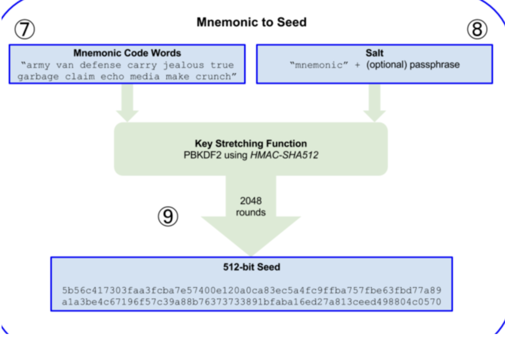
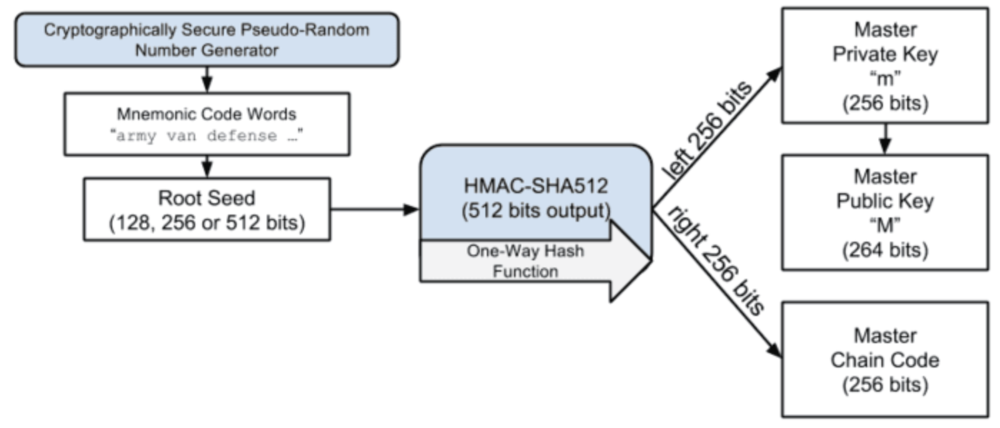
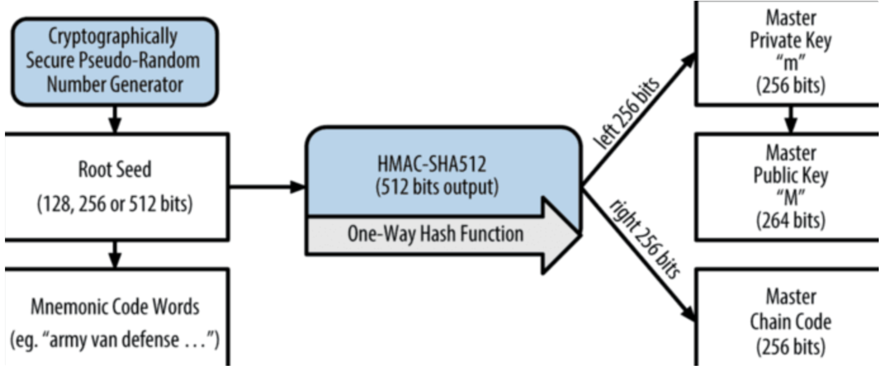

## 0x01.简介

现在各种DEX、钱包插件中的钱包导入及创建，大部分是通过助记词来备份的；

助记词是明文私钥的一种表现形式，最早由` BIP39 `提出，为了帮助用户记住复杂的私钥；

一组助记词可以生成各个链上的公私钥，进而可以算出钱包地址；掌握了助记词，就代表掌握了该组助记词上的所有资产；


## 0x02.助记词的生成

### 1.提供一个熵源

熵源是指一个位数为` n * 32 `的随机数，位数也被称为` ENT(entropy) `，通常在` 128 ~ 256 `之间；

熵源的位数越多，生成的助记词数量越多，代表越安全；

```go
// go get github.com/tyler-smith/go-bip39
entropy, _ := bip39.NewEntropy(256)
fmt.Printf("Type: %T\nValue: %v\n", entropy, entropy)
Hex := hex.EncodeToString(entropy)
fmt.Printf("Hex: %s\n", Hex)

// Type: []uint8
// Value: [181 226 47 80 46 190 16 74 25 168 247 25 64 215 117 86 126 144 92 143 201 222 240 138 153 15 65 82 10 218 57 206]
// Hex: b5e22f502ebe104a19a8f71940d775567e905c8fc9def08a990f41520ada39ce
```

### 2.生成checksum

有公式：` checksum = (ENT / 32) bits of SHA256(熵源) `；

使用128位的熵源，checksum也就是sha256的前4个bit；

```go
hash := sha256.Sum256(entropy)
// 256bit / 32 = 8bit,第一个字节的前8bit
checksum := hash[0]
fmt.Printf("Checksum: %x\n", checksum)

// Checksum: 64
```

### 3.分组生成助记词

将checksum添加到熵源的末尾，组成一个新的数字，之后将该数字每11位一组进行分组，作为单词表的索引，之后分别将表中的单词拼接即可；

```go
entropyWithChecksum := append(entropy, checksum)
fmt.Printf("Type: %T\nValue: %v\n", entropyWithChecksum, entropyWithChecksum)
Hex = hex.EncodeToString(entropyWithChecksum)
fmt.Printf("Hex: %s\n", Hex)
mnemonic, _ := bip39.NewMnemonic(entropy)
fmt.Printf("Mnemonic: %s\n", mnemonic)

// Type: []uint8
// Value: [181 226 47 80 46 190 16 74 25 168 247 25 64 215 117 86 126 144 92 143 201 222 240 138 153 15 65 82 10 218 57 206 100]
// Hex: b5e22f502ebe104a19a8f71940d775567e905c8fc9def08a990f41520ada39ce64
// Mnemonic: remove badge staff frost three celery grit bus bone allow tail provide trouble comic dish design vacuum feel duck live camera home transfer smart
```

此处上面的前3个byte的二进制为:` 1011 0101 1110 0010 0010 1111 `，能分成2个11位，一个是` 1011 0101 111 `-` 1455 `，另一个是` 0 0010 0010 11 `-` 139 `；

此时查看单词表中这两个位置：

```go
wordList := bip39.GetWordList()
fmt.Printf("1455: %s\n139: %s\n", wordList[1455], wordList[139])

// 1455: remove
// 139: badge
```

与上面对应；


## 0x03.助记词生成公私钥

### 1.PBKDF2函数得到种子

助记词表示的是一个长度为128 ~ 256位的熵，之后通过密钥延伸函数` PBKDF2 `导出一个512位的种子；

其基本原理是，通过一个伪随机函数，比如` HMAC函数 `，将明文和一个盐值作为输入，然后重复进行运算，最终产生密钥；

重复的次数只要足够的大，破解的成本就会很高；并且，添加的盐值也会增加攻击的难度；



```go
// 生成熵源
entropy, _ := bip39.NewEntropy(128)
// 生成助记词
mnemonic, _ := bip39.NewMnemonic(entropy)
// 生成种子
seed := bip39.NewSeed(mnemonic, "WZM")
fmt.Printf("Seed: %x\n", seed)

// NewSeed creates a hashed seed output given a provided string and password.
// No checking is performed to validate that the string provided is a valid mnemonic.
// func NewSeed(mnemonic string, password string) []byte {
// 	return pbkdf2.Key([]byte(mnemonic), []byte("mnemonic"+password), 2048, 64, sha512.New)
// }
```

### 2.种子生成主密钥、链码、公钥

种子被输入到` HMAC-SHA512 `哈希函数中，使用固定的密钥` Bitcoin seed `，得到一个512位的哈希值；

其中，前256位作为主私钥，后256位作为链码，用于后续派生子密钥；

之后利用椭圆曲线加密算法，得到一个33字节的，由` 0x02 `或` 0x03 `开头的压缩格式；或者一个65字节的非压缩格式；



下面的代码给出的是一个拓展公钥，版本号(4 bytes)、深度(1 byte)、父公钥指纹(4 bytes)、子密钥索引(4 bytes)、链码(32 bytes)、公钥(33 bytes)；

```go
// 生成熵源
entropy, _ := bip39.NewEntropy(128)
// 生成助记词
mnemonic, _ := bip39.NewMnemonic(entropy)
// 生成种子
seed := bip39.NewSeed(mnemonic, "WZM")
fmt.Printf("Seed: %x\n", seed)
// 生成主密钥
// go get github.com/tyler-smith/go-bip32
masterKey, _ := bip32.NewMasterKey(seed)
fmt.Printf("master key: %s\n", masterKey.String())
fmt.Printf("master key: %x\n", masterKey)
// 版本
fmt.Printf("Version: %x\n", masterKey.Version)
// 链码
fmt.Printf("Chain Code: %x\n", masterKey.ChainCode)
// 私钥
fmt.Printf("Key: %x\n", masterKey.Key)
// 拓展公钥
fmt.Printf("PublicKey: %x\n", masterKey.PublicKey())
```

### 3.主密钥派生出子密钥

主密钥、链码、索引合并在一起，并且同样是使用` HMAC-SHA512 `哈希函数，得到的前256位为子密钥，后256位为子链码；

一开始，索引是被设为0来产生主密钥的第0个子密钥；




## 0x04.子公私钥生成钱包地址

通过相应的派生逻辑得到子私钥后，按照各自的规则就可以生成地址；

### 1.BTC

Bitcoin的派生逻辑是：` m/44'/0'/0'/0/0 `，其中：

` m `：主节点

` 44' `：表示BIP44标准

` 0' `：币种，BTC是0

` 0'/0/0 `：表示账户、外部链、地址索引

```go
package main

import (
	"fmt"
	"github.com/btcsuite/btcd/btcutil"
	"github.com/btcsuite/btcd/chaincfg"
	"github.com/tyler-smith/go-bip32"
	"github.com/tyler-smith/go-bip39"
)

func main() {
	// 生成熵源
	entropy, _ := bip39.NewEntropy(128)
  
	// 生成助记词
	mnemonic, _ := bip39.NewMnemonic(entropy)
  
	// 生成种子
	seed := bip39.NewSeed(mnemonic, "WZM")
  
	// 生成主密钥
	masterKey, _ := bip32.NewMasterKey(seed)
  
	// 派生出Bitcoin的子私钥
	derivePath := []uint32{
		bip32.FirstHardenedChild + 44, // 44'
		bip32.FirstHardenedChild + 0,  // 0' (BTC)
		bip32.FirstHardenedChild + 0,  // 0' (账户)
		0,                             // 0 (外部链，即接收地址)
		0,                             // 0 (第一个地址)
	}
	currentKey := masterKey
	for _, index := range derivePath {
		currentKey, _ = currentKey.NewChildKey(index)
	}
	derivedPrivateKey := currentKey
	fmt.Printf("Derived Bitcoin private key(hex): %x\n", derivedPrivateKey)
	fmt.Printf("Derived Bitcoin private key(string): %s\n", derivedPrivateKey)
  
  // 私钥生成公钥(压缩格式)
	publicKey := derivedPrivateKey.PublicKey().Key
	fmt.Printf("Bitcoin Public key(hex): %x\n", publicKey)
	fmt.Printf("Bitcoin Public key(string): %s\n", publicKey)
  
	// 生成BTC地址
  // 1. PublicKey Hash = RIPEMD160(sha256(PublicKey))，20字节
  // 2. Version = 0x00(主网)，1字节
  // 3. CheckSum = sha256(sha256(Version + PublicKey Hash))[:4]，4字节
  // 4. Base58(Version + PublicKey Hash + CheckSum)
	// go get github.com/btcsuite/btcd
	pubKey, _ := btcutil.NewAddressPubKey(publicKey, &chaincfg.MainNetParams)
	address := pubKey.AddressPubKeyHash()
	fmt.Printf("Address (string): %s\n", address)
}
```


### 2.ETH

ETH的派生逻辑：` m/44'/60'/0'/0/0 `；

```go
package main

import (
	"crypto/ecdsa"
	"fmt"
	"github.com/ethereum/go-ethereum/crypto"
	"github.com/tyler-smith/go-bip32"
	"github.com/tyler-smith/go-bip39"
)

func main() {
	// 生成熵源
	entropy, _ := bip39.NewEntropy(128)
  
	// 生成助记词
	mnemonic, _ := bip39.NewMnemonic(entropy)
  
	// 生成种子
	seed := bip39.NewSeed(mnemonic, "WZM")
  
	// 生成主密钥
	masterKey, _ := bip32.NewMasterKey(seed)
  
	// 派生出Ethereum的子私钥
	derivePath := []uint32{
		bip32.FirstHardenedChild + 44, // 44'
		bip32.FirstHardenedChild + 60, // 60' (ETH)
		bip32.FirstHardenedChild + 0,  // 0' (账户)
		0,                             // 0 (外部链，即接收地址)
		0,                             // 0 (第一个地址)
	}
	currentKey := masterKey
	for _, index := range derivePath {
		currentKey, _ = currentKey.NewChildKey(index)
	}
	derivedPrivateKey := currentKey
  
	// 转换成以太坊的ECDSA私钥
	// go get github.com/ethereum/go-ethereum
	ethPrivateKey, _ := crypto.ToECDSA(derivedPrivateKey.Key)
	fmt.Printf("Derived Ethereum private key(hex): %x\n", ethPrivateKey)
	fmt.Printf("Derived Ethereum private key(string): %s\n", ethPrivateKey)
  
	// 私钥生成公钥
	ethPublicKey := ethPrivateKey.Public().(*ecdsa.PublicKey)
	publicKey := crypto.FromECDSAPub(ethPublicKey)
	fmt.Printf("Ethereum Public key(hex): %x\n", publicKey)
	fmt.Printf("Ethereum Public key(string): %s\n", publicKey)
  
	// 生成ETH地址
	// 1. 对公钥(去掉开头的0x04前缀)进行Keccak256哈希
	// 2. 取哈希的最后20字节作为地址
	address := crypto.PubkeyToAddress(*ethPublicKey).Hex()
	fmt.Printf("Ethereum address: %s\n", address)
}
```
