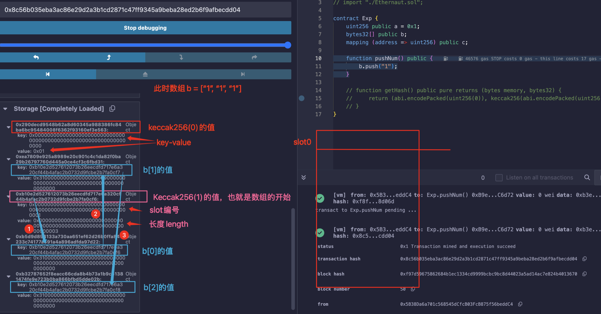
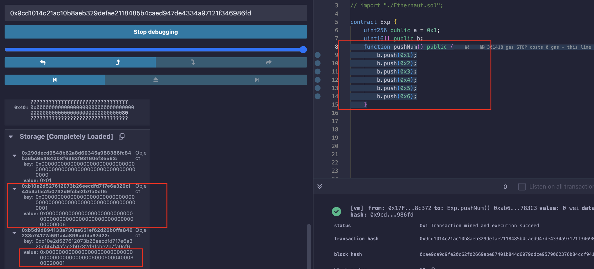
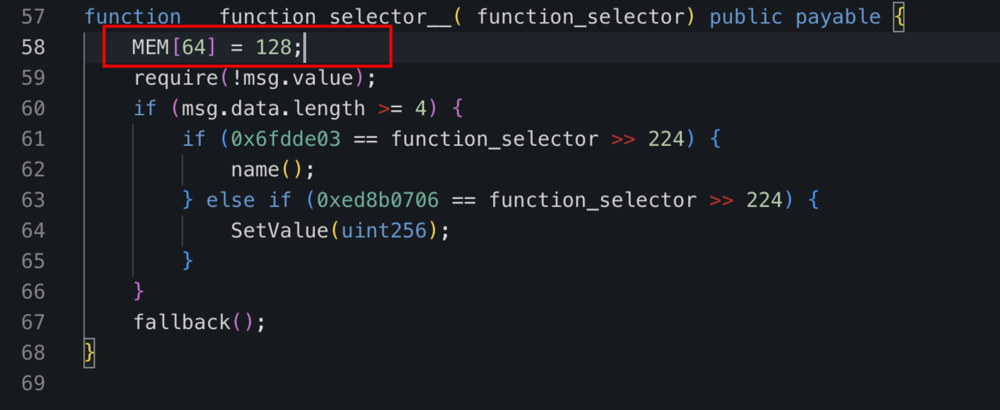
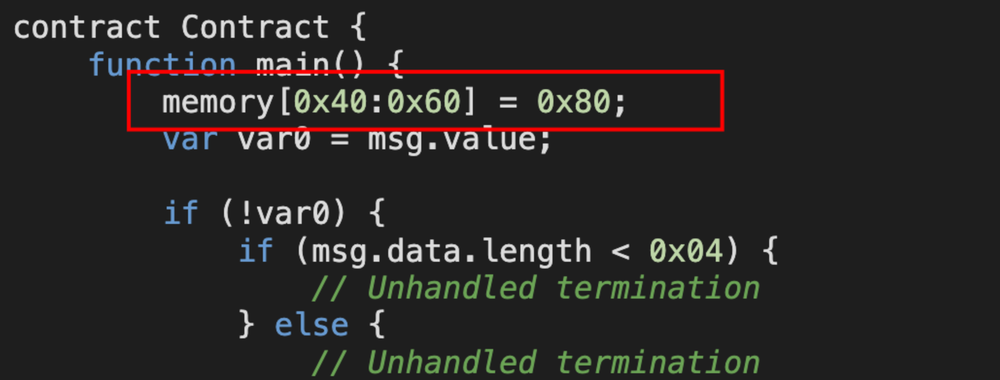
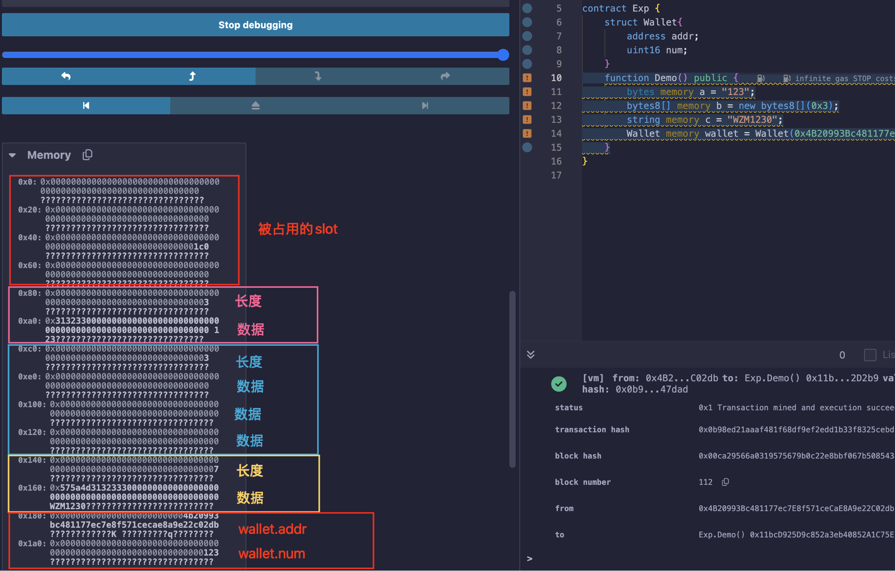

## 1.Storage中

### 1.1-基本原则(基本的值类型)

在这里面的变量都是独立的，互相不影响，所以非常"安全"；

均存储在` slot `中，` slot `有2^256个，每个长度256位；

从` 0 `开始连续往后存储（除动态数组和映射），当有连续几个都小于256位时，会尝试将它们放在同一个` slot `中；

同时也遵循以下规则：

* 比如有小于256位的数据需要存储，会存在低阶位置（右边）
* ` Value types `使用同样多的位数去存储（比如` uint128 `，会使用128位去存储它，无论它何值）
* 当前` slot `不够存，则会存在下一个` slot `中
* ` Structs `和` Array `会在一个新的` slot `开始存，并且它们的值会打包的很紧密
* ` Struct `和` Array `后面的数据，会单开一个` slot `


### 1.2-Dynamic Arrays & mapping

由于动态数组和映射的不可预测性，它们不像正常的状态变量一样紧跟着在后面存，而是占用一个新的` slot `，再根据它们自己的规则去存；

假设有一个动态数组或者映射，它占用的是` slot `的第` p `号位置；

#### 对于动态数组而言：

在` slot p `的位置存储着数组长度，在` slot Keccak256(p) `的位置开始存储数组元素；

|            Key            |    Value     |
| :-----------------------: | :----------: |
|        slot ` 0 `         |   其他数据   |
|            ...            |     ...      |
|        slot ` p `         | ` 数组长度 ` |
|            ...            |     ...      |
|   slot ` Keccak256(p) `   |    元素1     |
| slot ` Keccak256(p) + 1 ` |    元素2     |
|            ...            |     ...      |

```solidity
function getHash() public pure returns (bytes memory, bytes32) {
    return (abi.encodePacked(uint256(0)), keccak256(abi.encodePacked(uint256(0))));
    // bytes: 0x0000000000000000000000000000000000000000000000000000000000000000
    // bytes32: 0x290decd9548b62a8d60345a988386fc84ba6bc95484008f6362f93160ef3e563
}
function getHash() public pure returns (bytes memory, bytes32) {
    return (abi.encodePacked(uint256(1)), keccak256(abi.encodePacked(uint256(1))));
    // bytes: 0x0000000000000000000000000000000000000000000000000000000000000001
    // bytes32: 0xb10e2d527612073b26eecdfd717e6a320cf44b4afac2b0732d9fcbe2b7fa0cf6
}
```



同样的，若是每个元素数据小于256位，和上面的规则一样，紧凑的往下写，从小端往大端写：



#### 对于映射而言：

在` slot p `的位置会存储全0数据，代表着此处是一个映射的开始；

映射的` key `会存在一个经过计算的` slot `：` slot Keccak256(h(k) . p) `，映射的` value `则会被直接存在对应` slot `的` value `中；

其中，` h(k) `中的` h `代表类型，` address `、` uint256 `等等，` k `就是映射的` key `值；

` . `代表连接，` solidity `就可以用` abi.encode(a, b) `来实现相同功能；

` p `是当前映射首个元素的` slot `编号；

|               Key               |               Value               |
| :-----------------------------: | :-------------------------------: |
|           slot ` 0 `            |             其他数据              |
|               ...               |                ...                |
|           slot ` p `            | 全0(占用，代表这边是个映射的起始) |
|               ...               |                ...                |
| slot ` Keccak256(h(key1) . p) ` |            key1.value             |
|               ...               |                ...                |
| slot ` Keccak256(h(key2) . p) ` |            key2.value             |
|               ...               |                ...                |

##### 例子1(多个连续映射)

两个映射，分别存储以下数据：

```solidity
contract Exp {
    uint256 public a = 0x1;
    mapping (address => uint256) public b;
    mapping (address => uint256) public c;

    function addMapping() public {
        b[address(0x5B38Da6a701c568545dCfcB03FcB875f56beddC4)] = 0xb11;
        c[address(0x78731D3Ca6b7E34aC0F824c42a7cC18A495cabaB)] = 0xc11;

        b[address(0xAb8483F64d9C6d1EcF9b849Ae677dD3315835cb2)] = 0xb22;
        c[address(0x617F2E2fD72FD9D5503197092aC168c91465E7f2)] = 0xc22;

        b[address(0x4B20993Bc481177ec7E8f571ceCaE8A9e22C02db)] = 0xb33;
        c[address(0x17F6AD8Ef982297579C203069C1DbfFE4348c372)] = 0xc33;
    }
}
```

这是该合约调试的结果：

> - 0x290decd9548b62a8d60345a988386fc84ba6bc95484008f6362f93160ef3e563:Object
>     - key:0x0000000000000000000000000000000000000000000000000000000000000000
>     - value:0x01
> - 0x34a2b38493519efd2aea7c8727c9ed8774c96c96418d940632b22aa9df022106:Object
>     - key:0x36306db541fd1551fd93a60031e8a8c89d69ddef41d6249f5fdc265dbc8fffa2
>     - value:0x0000000000000000000000000000000000000000000000000000000000000b11
> - 0xf5e7424a6e4079071264af0bf2d5ca3530102dfccdbd193e7d54d0d4400332e0:Object
>     - key:0x4f3049662ef87b9e630d98ff73343a6afe9cd9c07fbd5dfe02b76d8fef856cb2
>     - value:0x0000000000000000000000000000000000000000000000000000000000000c11
> - 0x94b29c01ed483e694a7ecf386d384987d4d3e9d4e6c476f5b97302b23ff871c9:Object
>     - key:0x9d4d959825f0680278e64197773b2a50cd78b2b2cb00711ddbeebf0bf93cd8a4
>     - value:0x0000000000000000000000000000000000000000000000000000000000000b22
> - 0x3a885bd4536bf506a6b539c1ecc761dabfeafcbdc0e1f368493815c2bebe5da6:Object
>     - key:0xd9ea8f4d7f096f77b3e4169a2c25f1eb750f25bc40cad854f045cfb680dbd21d
>     - value:0x0000000000000000000000000000000000000000000000000000000000000c22
> - 0x709c4b690342f2b3b4553bcc137e89412180007fbe4ac36592d4bb2c9003b39b:Object
>     - key:0xe20f19dc6931eb9e42fe3f21abe1a9ef59942d8e586871d88564d0d0b63a5e5c
>     - value:0x0000000000000000000000000000000000000000000000000000000000000b33
> - 0x16086c92369a425dfd790c80c90e5c1364cccb1a6ffc51553bc237bad3e37c09:Object
>     - key:0xeb070bdf6b9b9e994516da4d935f3719e4f3890dd106aba68bfe82094e359b19
>     - value:0x0000000000000000000000000000000000000000000000000000000000000c33

下面我们来验证，按照推断，` 映射b `应该从` slot 1 `开始，` 映射c `应该从` slot 2 `开始；

``` solidity
// 映射b的第一个元素，bytes32: 0x36306db541fd1551fd93a60031e8a8c89d69ddef41d6249f5fdc265dbc8fffa2
function getHash_b1() public pure returns (bytes32){
    return keccak256(abi.encode(address(0x5B38Da6a701c568545dCfcB03FcB875f56beddC4), uint256(1)));
}
// 映射b的第二个元素，bytes32: 0x9d4d959825f0680278e64197773b2a50cd78b2b2cb00711ddbeebf0bf93cd8a4
function getHash_b2() public pure returns (bytes32){
    return keccak256((abi.encode(address(0xAb8483F64d9C6d1EcF9b849Ae677dD3315835cb2), uint256(1))));
}
// 映射c的第一个元素，bytes32: 0x4f3049662ef87b9e630d98ff73343a6afe9cd9c07fbd5dfe02b76d8fef856cb2
function getHash_c1() public pure returns (bytes32){
    return keccak256((abi.encode(address(0x78731D3Ca6b7E34aC0F824c42a7cC18A495cabaB), uint256(2))));
}
// 映射c的第二个元素，bytes32: 0xd9ea8f4d7f096f77b3e4169a2c25f1eb750f25bc40cad854f045cfb680dbd21d
function getHash_c2() public pure returns (bytes32){
    return keccak256((abi.encode(address(0x617F2E2fD72FD9D5503197092aC168c91465E7f2), uint256(2))));
}
```

##### 例子2(多重映射)

一个三重映射：` address => uint256 => uint256 `：

```solidity
contract Exp {
    uint256 public a = 0x1;
    mapping (address => mapping (uint256 => uint256)) public data;

    function addMapping() public {
        data[address(0x5B38Da6a701c568545dCfcB03FcB875f56beddC4)][3] = 4;
        data[address(0xAb8483F64d9C6d1EcF9b849Ae677dD3315835cb2)][7] = 8;
    }
}
```

调试的结果：

> - 0x290decd9548b62a8d60345a988386fc84ba6bc95484008f6362f93160ef3e563:Object
>     - key:0x0000000000000000000000000000000000000000000000000000000000000000
>     - value:0x01
> - 0x6d56a438fa5dd6d0bbc7c165fa370e93f31dc10c1348391ce17cdc6a22c94479:Object
>     - key:0xf72ff45ebf51ff9fe6584c33c990ae8cc8de482bd70289044a93604d667fc9ad
>     - value:0x0000000000000000000000000000000000000000000000000000000000000004
> - 0xc116603da12a240205c7c8b682cead30acae1a1f283e7a40647ef98139f92d02:Object
>     - key:0x287bec35ef93239ef6c83981c0922f4e9288d308bc2bfa6a0d60780af18028b6
>     - value:0x0000000000000000000000000000000000000000000000000000000000000008

验证，从前往后一个一个算，` Keccak256(address(k) . p) ` --> ` Keccak256(uint256(k) . Keccak256(address(k) . p)) `：

```solidity
// 映射的第一个元素：bytes32: 0xf72ff45ebf51ff9fe6584c33c990ae8cc8de482bd70289044a93604d667fc9ad
function getHash_data1() public pure returns (bytes32){
    // 先计算[address(k), p]
    bytes32 temp = keccak256(abi.encode(address(0x5B38Da6a701c568545dCfcB03FcB875f56beddC4), uint256(1)));
    // 再计算{uint256(k), [address(k), p]}
    return keccak256(abi.encode(uint256(3), temp));
}
// 映射的第二个元素：bytes32: 0x287bec35ef93239ef6c83981c0922f4e9288d308bc2bfa6a0d60780af18028b6
function getHash_data2() public pure returns (bytes32){
    bytes32 temp = keccak256(abi.encode(address(0xAb8483F64d9C6d1EcF9b849Ae677dD3315835cb2), uint256(1)));
    return keccak256(abi.encode(uint256(7), temp));
}
```

##### 例子3(string和bytes)

> 注意：
>
> 对于基本值类型，` h `都是将其扩充为256位；
>
> 对于` string `和` byte array `，` h `不将其扩充，保持原样；

示例合约：

```solidity
// SPDX-License-Identifier: MIT
pragma solidity ^0.8.0;
// import "./Ethernaut.sol";

contract Exp {
    uint256 public a = 0x1;
    mapping (string => uint256) public data;

    // key:0x3760e61363bd6582908f2b38ae298a6e2239ed14711faf5dace0ac9362a82e59
    // value:0x0000000000000000000000000000000000000000000000000000000000000002
    function addMapping() public {
        data["WZM"] = 2;
    }
    // 0:bytes: a 0x575a4d
    // 1:bytes: b 0x0000000000000000000000000000000000000000000000000000000000000001
    // 2:bytes: c 0x575a4d0000000000000000000000000000000000000000000000000000000000000001
    function getbytes() public pure returns (bytes memory a, bytes memory b, bytes memory c){
        a = (abi.encodePacked("WZM"));
        b = (abi.encodePacked(uint256(1)));
        c = abi.encodePacked("WZM", uint256(1));
    }
    // bytes32: 0x3760e61363bd6582908f2b38ae298a6e2239ed14711faf5dace0ac9362a82e59
    function getHash() public pure returns (bytes32){
        return keccak256(abi.encodePacked("WZM", uint256(1)));
    }
}
```


### 1.3-string & bytes

这两个类型编码的方式相同，就和` bytes1[] `类似，但不同长度的编码方式不一样；

#### 长度不超过31字节

新起一个` slot `，编号不需要计算，前31个字节存放数据，最后一个字节存放` 数据长度 * 2(也就是有多少个hex) `；

例子：

```solidity
contract Exp {
    uint256 public a = 0x1;
    bytes public b = "WZM";
    string public c = "WZM1230";
}
```

结果：

> - 0x290decd9548b62a8d60345a988386fc84ba6bc95484008f6362f93160ef3e563:Object
>     - key:0x0000000000000000000000000000000000000000000000000000000000000000
>     - value:0x0000000000000000000000000000000000000000000000000000000000000001
> - 0xb10e2d527612073b26eecdfd717e6a320cf44b4afac2b0732d9fcbe2b7fa0cf6:Object
>     - key:0x0000000000000000000000000000000000000000000000000000000000000001
>     - value:0x575a4d0000000000000000000000000000000000000000000000000000000006
> - 0x405787fa12a823e0f2b7631cc41b3ba8828b3321ca811111fa75cd3aa3bb5ace:Object
>     - key:0x0000000000000000000000000000000000000000000000000000000000000002
>     - value:0x575a4d313233300000000000000000000000000000000000000000000000000e


#### 长度超过31字节

和动态数组几乎一样，在` slot p `的位置存储着长度` length * 2 + 1 `，在` slot Keccak256(p) `的位置开始存储数组元素；

例子：

```solidity
contract Exp {
    uint256 public a = 0x1;
    // length = 33
    bytes public b = "WZMWZMWZMWZMWZMWZMWZMWZMWZMWZMWZM";
    // length = 35
    string public c = "WZM1230WZM1230WZM1230WZM1230WZM1230";
}
```

结果：

> - 0x290decd9548b62a8d60345a988386fc84ba6bc95484008f6362f93160ef3e563:Object
>     - key:0x0000000000000000000000000000000000000000000000000000000000000000
>     - value:0x0000000000000000000000000000000000000000000000000000000000000001
> - 0xb5d9d894133a730aa651ef62d26b0ffa846233c74177a591a4a896adfda97d22:Object----2.` slot Keccak(1) `，存储数据，和bytes1[]一样的存储方式
>     - key:0xb10e2d527612073b26eecdfd717e6a320cf44b4afac2b0732d9fcbe2b7fa0cf6
>     - value:0x575a4d575a4d575a4d575a4d575a4d575a4d575a4d575a4d575a4d575a4d575a
> - 0xea7809e925a8989e20c901c4c1da82f0ba29b26797760d445a0ce4cf3c6fbd31:Object----3.` slot Keccak(1)+1 `，继续存储数据
>     - key:0xb10e2d527612073b26eecdfd717e6a320cf44b4afac2b0732d9fcbe2b7fa0cf7
>     - value:0x4d00000000000000000000000000000000000000000000000000000000000000
> - 0xb10e2d527612073b26eecdfd717e6a320cf44b4afac2b0732d9fcbe2b7fa0cf6:Object----1.` slot 1 `，存储` 长度(length * 2 + 1)` 
>     - key:0x0000000000000000000000000000000000000000000000000000000000000001
>     - value:0x0000000000000000000000000000000000000000000000000000000000000043
> - 0x1ab0c6948a275349ae45a06aad66a8bd65ac18074615d53676c09b67809099e0:Object
>     - key:0x405787fa12a823e0f2b7631cc41b3ba8828b3321ca811111fa75cd3aa3bb5ace
>     - value:0x575a4d31323330575a4d31323330575a4d31323330575a4d31323330575a4d31
> - 0x2f2149d90beac0570c7f26368e4bc897ca24bba51b1a0f4960d358f764f11f31:Object
>     - key:0x405787fa12a823e0f2b7631cc41b3ba8828b3321ca811111fa75cd3aa3bb5acf
>     - value:0x3233300000000000000000000000000000000000000000000000000000000000
> - 0x405787fa12a823e0f2b7631cc41b3ba8828b3321ca811111fa75cd3aa3bb5ace:Object
>     - key:0x0000000000000000000000000000000000000000000000000000000000000002
>     - value:0x0000000000000000000000000000000000000000000000000000000000000047


## 2.Memory中

> 仅有` string `，` bytes `，` array `，` struct `使用memory；

以太坊内存中保留了前四个` slot `，分别是：

* ` 0x00 - 0x1f, 0x20 - 0x3f `：两个` slot `，存储散列方法
* ` 0x40 - 0x5f `：当前分配的内存大小
* ` 0x60 - 0x7f `：zero slot（此部分不能被写入）

> 所以在分析字节码的时候，经常会看到代码的一开始有` MEM[xxx] = 0x80 `:
>
> 
>
> 

每个元素均占用一个` slot `，这点和在Storage中不同：

```solidity
uint8[4] a;
```

在` Storage `中，仅占用1个` slot `；而在` Memory `中，却占用4个` slot `；

例子：

```solidity
contract Exp {
    struct Wallet{
        address addr;
        uint16 num;
    }
    function Demo() public {
        bytes memory a = "123";
        bytes8[] memory b = new bytes8[](0x3);
        string memory c = "WZM1230";
        Wallet memory wallet = Wallet(0x4B20993Bc481177ec7E8f571ceCaE8A9e22C02db, 0x123);
    }
}
```




参考：[Solidity Documents-INTERNALS](https://docs.soliditylang.org/en/latest/internals/layout_in_storage.html)