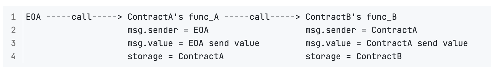
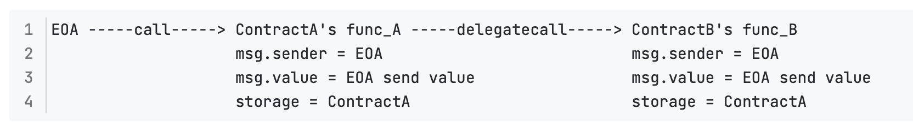
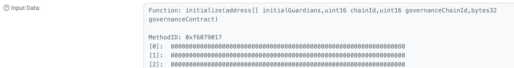

### Call和DelegateCall

1. 当一个EOA使用 ` call ` 来调用合约A中的函数func_A，func_A再使用 ` call ` 调用合约B中的函数func_B时：



也就是当执行 ` call ` 的时候，它的` msg.sender是调用它的人 `，` msg.value是调用它的人携带的金额 `，` 执行的上下文及storage是函数存在的那个合约 `；


2. 当一个EOA使用 ` call ` 来调用合约A中的函数func_A，func_A再使用 ` delegatecall ` 调用合约B中的函数func_B时：



当执行 ` delegatecall ` 时，` msg.sender及msg.value都是它调用者的调用者 `，` 执行的上下文是它的调用者的环境 `，可以理解为ContractA中没有` func_B `，所以借用了ContractB中的` func_B `来执行逻辑，环境还是ContractA自身的环境；


### Proxy合约和Implementation合约

由于合约一旦部署上链都是不可更改的，要是合约有漏洞或者想升级合约功能，那要怎么办？合约中的数据要怎么办？

所以就有了Proxy模式，在Proxy合约中存储数据，然后利用` delegatecall `来调用Implementation合约中实现的功能，这样升级时只需要更换Implementation合约的地址；


### Constructor和initializer修饰器

合约的构造函数是在合约部署时自动执行的，里面放着重要的合约初始化逻辑；

但在Proxy模式中可能使用不了，因为Implementation合约的` Constructor `只会修改它自己的storage，根本影响不了Proxy合约的storage；

因此，就需要一些额外的逻辑来初始化Implementation合约，将Constructor转变为一个常规的函数` initialize `或者` init `，这样在Proxy合约中调用它时，会成功修改Proxy合约的storage；但是，需要有一些逻辑来保证它们只能运行一次，不然还是会被恶意利用；

[OpenZeppelin的Initializable.sol](https://github.com/OpenZeppelin/openzeppelin-contracts/blob/master/contracts/proxy/utils/Initializable.sol)

```solidity
// 非完整合约
abstract contract Initializable {

    struct InitializableStorage {
        uint64 _initialized; // 初始化版本号
        bool _initializing; // 是否正在初始化
    }

    // Initializable的slot
    // keccak256(abi.encode(uint256(keccak256("openzeppelin.storage.Initializable")) - 1)) & ~bytes32(uint256(0xff))
    bytes32 private constant INITIALIZABLE_STORAGE = 0xf0c57e16840df040f15088dc2f81fe391c3923bec73e23a9662efc9c229c6a00;

    // 初始化
    modifier initializer() {
        // solhint-disable-next-line var-name-mixedcase
        InitializableStorage storage $ = _getInitializableStorage();

        // Cache values to avoid duplicated sloads
        bool isTopLevelCall = !$._initializing;
        uint64 initialized = $._initialized;

        // Allowed calls:
        // - initialSetup: the contract is not in the initializing state and no previous version was
        //                 initialized
        // - construction: the contract is initialized at version 1 (no reinitialization) and the
        //                 current contract is just being deployed
        bool initialSetup = initialized == 0 && isTopLevelCall;
        bool construction = initialized == 1 && address(this).code.length == 0;

        if (!initialSetup && !construction) {
            revert InvalidInitialization();
        }
        $._initialized = 1;
        if (isTopLevelCall) {
            $._initializing = true;
        }
        _;
        if (isTopLevelCall) {
            $._initializing = false;
            emit Initialized(1);
        }
    }

    // 重新初始化
    modifier reinitializer(uint64 version) {
        // solhint-disable-next-line var-name-mixedcase
        InitializableStorage storage $ = _getInitializableStorage();

        if ($._initializing || $._initialized >= version) {
            revert InvalidInitialization();
        }
        $._initialized = version;
        $._initializing = true;
        _;
        $._initializing = false;
        emit Initialized(version);
    }

    // 是否在初始化过程中
    modifier onlyInitializing() {
        _checkInitializing();
        _;
    }
}
```

重要的3个修饰符：

1. ` initializer `:合约从未初始化或正在初始化
2. ` reinitializer(n) `:版本号<n可以重新初始化
3. ` onlyInitializing `:是否正在初始化中


### TPP和UUPS

` delegatecall `、` Proxy模式 `和` initializer `都了解了之后，下面来说两种重要的代理模版；

首先先设想一个情景，Proxy合约和Implementation合约中都有一个同名函数` transferTo() `，当admin通过Proxy合约想执行这个函数，最终会是哪个函数执行（是直接call的，还是通过delegatecall的）？

这样可能会导致冲突，或者被恶意利用，所以就有了这两个解决方法；

#### TPP(Transparent Proxy Pattern)

先来看看TPP模式的原理：

```solidity
contract TransparentProxy {
    address implementation; // implementation合约地址
    address admin; // 管理员
    // 可以自定义一些需要的storage，但在implementation合约中也需要一致，防止slot冲突
    
    // 初始化admin地址和implementation合约地址
    constructor(address _implementation){
        admin = msg.sender;
        implementation = _implementation;
    }

    // 当调用合约不存在的方法时，会触发fallback函数
    fallback() external payable {
        require(msg.sender != admin);
        (bool success, bytes memory data) = implementation.delegatecall(msg.data);
    }

    // 升级合约
    function upgrade(address newImplementation) external {
        if (msg.sender != admin) revert();
        implementation = newImplementation;
    }
}
```

可以看到，为了解决上面情景中的冲突，TPP通过区分admin和普通用户来决定调用哪个` upgrade `函数；

但该模式的缺点就是开销大，需要额外的逻辑来管理所有可升级的函数以及识别调用者是admin还是普通用户；


#### UUPS(Universal Upgradeable Proxy Standard)

所以就有了UUPS模式，其核心原理就是` Proxy合约和Implementation合约分离 `，且使用了[ERC-1967](https://eips.ethereum.org/EIPS/eip-1967)标准来存储` implementation `合约地址；

**Proxy合约**中存储所有的storage，但自身是不包含任何业务逻辑的（也不包括升级），通过` delegatecall `来将所有调用转发给Implementation合约；

**Implementation合约**中包含业务逻辑，包含升级模块，自身是可被替换的；

Proxy合约：[OpenZeppelin的具体实现](https://github.com/OpenZeppelin/openzeppelin-contracts/tree/master/contracts/proxy)

```solidity
// 不是完全体，仅包含重要函数
contract ERC1967Proxy {
    // 逻辑合约地址
    // solhint-disable-next-line private-vars-leading-underscore
    bytes32 internal constant IMPLEMENTATION_SLOT = 0x360894a13ba1a3210667c828492db98dca3e2076cc3735a920a3ca505d382bbc;

    // 管理员
    // solhint-disable-next-line private-vars-leading-underscore
    bytes32 internal constant ADMIN_SLOT = 0xb53127684a568b3173ae13b9f8a6016e243e63b6e8ee1178d6a717850b5d6103;

    // Beacon地址
    // solhint-disable-next-line private-vars-leading-underscore
    bytes32 internal constant BEACON_SLOT = 0xa3f0ad74e5423aebfd80d3ef4346578335a9a72aeaee59ff6cb3582b35133d50;

    // 初始化时，将实现合约地址写入 IMPLEMENTATION_SLOT
    constructor(address implementation, bytes memory _data) payable {
        upgradeToAndCall(implementation, _data);
    }

    // 升级合约，修改slot，只能内部调用，无selector
    function upgradeToAndCall(address newImplementation, bytes memory data) internal {
        _setImplementation(newImplementation);
        emit IERC1967.Upgraded(newImplementation);

        if (data.length > 0) {
            Address.functionDelegateCall(newImplementation, data);
        } else {
            _checkNonPayable();
        }
    }

    // 代理合约调用逻辑合约
    function _delegate(address implementation) internal virtual {
        assembly {
            // Copy msg.data. We take full control of memory in this inline assembly
            // block because it will not return to Solidity code. We overwrite the
            // Solidity scratch pad at memory position 0.
            calldatacopy(0, 0, calldatasize())

            // Call the implementation.
            // out and outsize are 0 because we don't know the size yet.
            let result := delegatecall(gas(), implementation, 0, calldatasize(), 0, 0)

            // Copy the returned data.
            returndatacopy(0, 0, returndatasize())

            switch result
            // delegatecall returns 0 on error.
            case 0 {
                revert(0, returndatasize())
            }
            default {
                return(0, returndatasize())
            }
        }
    }

    // 代理合约调用逻辑合约
    function _fallback() internal virtual {
        _delegate(_implementation());
    }

    // 遇到不存在的函数，调用_fallback
    fallback() external payable virtual {
        _fallback();
    }
}
```

Implementation合约：[OpenZeppelin的具体实现](https://github.com/OpenZeppelin/openzeppelin-contracts-upgradeable/blob/master/contracts/proxy/utils/UUPSUpgradeable.sol)

```solidity
// 仅包含重要函数
abstract contract UUPSUpgradeable is Initializable, IERC1822Proxiable {
    /// @custom:oz-upgrades-unsafe-allow state-variable-immutable
    address private immutable __self = address(this);

    string public constant UPGRADE_INTERFACE_VERSION = "5.0.0";

    // 升级合约
    function upgradeToAndCall(address newImplementation, bytes memory data) public payable virtual onlyProxy {
        _authorizeUpgrade(newImplementation);
        _upgradeToAndCallUUPS(newImplementation, data);
    }

    // 授权升级，仅owner可以
    function _authorizeUpgrade(address newImplementation) internal virtual;

    function _upgradeToAndCallUUPS(address newImplementation, bytes memory data) private {
        try IERC1822Proxiable(newImplementation).proxiableUUID() returns (bytes32 slot) {
            if (slot != ERC1967Utils.IMPLEMENTATION_SLOT) {
                revert UUPSUnsupportedProxiableUUID(slot);
            }
            // 此时去修改slot
            ERC1967Utils.upgradeToAndCall(newImplementation, data);
        } catch {
            // The implementation is not UUPS
            revert ERC1967Utils.ERC1967InvalidImplementation(newImplementation);
        }
    }
}
```

仔细看上面两个合约，都有个` upgradeToAndCall() `函数，但是它们是不会冲突的，因为**ERC1967Utils**中的是internal函数，而**UUPSUpgradeable**中的是external函数，前者不会有selector（最终会被inline成一段 `sstore` + `call` 汇编），后者有selector，用户通过Proxy合约调用` upgradeToAndCall() `只会去执行**UUPSUpgradeable**中的函数，也就是Implementation合约中的；

所以无需担心冲突；


### OpenZeppelin UUPS Uninitialized Proxies Vulnerability

正如前面所说，当UUPS的Implementation合约部署时，它的` Constructor `实际上是被转化成了一个` initialize `函数，然后被` initializer `修饰，实际上是没有执行的；

**正确的流程应该是：**

1. **部署Implementation合约**
2. **管理员通过Proxy合约来调用Implementation合约的` initialize() `函数初始化**

这边就是关键的地方，若管理员疏忽，忘记初始化，或者某个升级的交易revert了导致初始化失败，这样Implementation合约中的` initialize() `函数是能被任何人通过Proxy合约调用的；


### Wormhole Vulnerability

#### 原理

Wormhole的漏洞和上面类似，也是使用了UUPS的代理模式，最主要的区别就是升级由Guardians来守护，并且需要生成一个多签消息才能被授权升级；

这是Implementation合约的地址：https://etherscan.io/address/0x736d2a394f7810c17b3c6fed017d5bc7d60c077d；

从最初的交易内容看，部署时执行了` initialize() `这个函数：



```solidity
// 该函数已经升级
function initialize(address[] memory initialGuardians, uint16 chainId, uint16 governanceChainId, bytes32 governanceContract) initializer public {
    require(initialGuardians.length > 0, "no guardians specified");

    Structs.GuardianSet memory initialGuardianSet = Structs.GuardianSet({
        keys : initialGuardians,
        expirationTime : 0
    });

    storeGuardianSet(initialGuardianSet, 0);
    // initial guardian set index is 0, which is the default value of the storage slot anyways

    setChainId(chainId);

    setGovernanceChainId(governanceChainId);
    setGovernanceContract(governanceContract);
}
```

但由于管理员忘记了初始化，同时也没有配置Guardians等设置，所以黑客完全可以通过Proxy合约来初始化Guardians；

[Wormhole Governance.sol](https://github.com/wormhole-foundation/wormhole/blob/main/ethereum/contracts/Governance.sol)合约，升级函数在这里面是` submitContractUpgrade() `函数:

```solidity
function submitContractUpgrade(bytes memory _vm) public {
    require(!isFork(), "invalid fork");

    Structs.VM memory vm = parseVM(_vm);

    // Verify the VAA is valid before processing it
    (bool isValid, string memory reason) = verifyGovernanceVM(vm);
    require(isValid, reason);

    GovernanceStructs.ContractUpgrade memory upgrade = parseContractUpgrade(vm.payload);

    // Verify the VAA is for this module
    require(upgrade.module == module, "Invalid Module");

    // Verify the VAA is for this chain
    require(upgrade.chain == chainId(), "Invalid Chain");

    // Record the governance action as consumed
    setGovernanceActionConsumed(vm.hash);

    // Upgrades the implementation to the new contract
    upgradeImplementation(upgrade.newContract);
}
```

参数中的` bytes memory _vm `是由Guardians签名的多签，包含着升级的合约；随后通过各种验证（其实无需什么验证，因为initialize()函数中Guardians可任由黑客设置），会执行` upgradeImplementation() `函数：

```solidity
function upgradeImplementation(address newImplementation) internal {
    address currentImplementation = _getImplementation();

    _upgradeTo(newImplementation);

    // Call initialize function of the new implementation
    (bool success, bytes memory reason) = newImplementation.delegatecall(abi.encodeWithSignature("initialize()"));

    require(success, string(reason));

    emit ContractUpgraded(currentImplementation, newImplementation);
}
```

最终执行新合约的` initialize() `函数，只要恶意合约中` initialize() `函数带有` SELFDESTRUCT `，整个系统将会瘫痪；


#### 攻击链路

1. 通过查看` Proxy合约 `的` _initialized变量 `的slot为0x00等方法得知` implementation合约 `未初始化

2. 通过` Proxy合约 `delegatecall` implementation合约 `的` initialize() `函数，以此来设置Guardians

3. 部署一个` initialize() `函数中带有` SELFDESTRUCT `的恶意合约

4. 通过` Proxy合约 `delegatecall` implementation合约 `的` submitContractUpgrade() `函数，来升级到恶意合约

5. 触发` initialize() `函数中的` SELFDESTRUCT `，导致` implementation合约 `被销毁，资金被锁定在` Proxy合约 `中

可以参考Ethernaut的[Motorbike](https://github.com/ZemWang1230/Ethernaut_WP/blob/main/Level_25.Motorbike.md)关卡；

