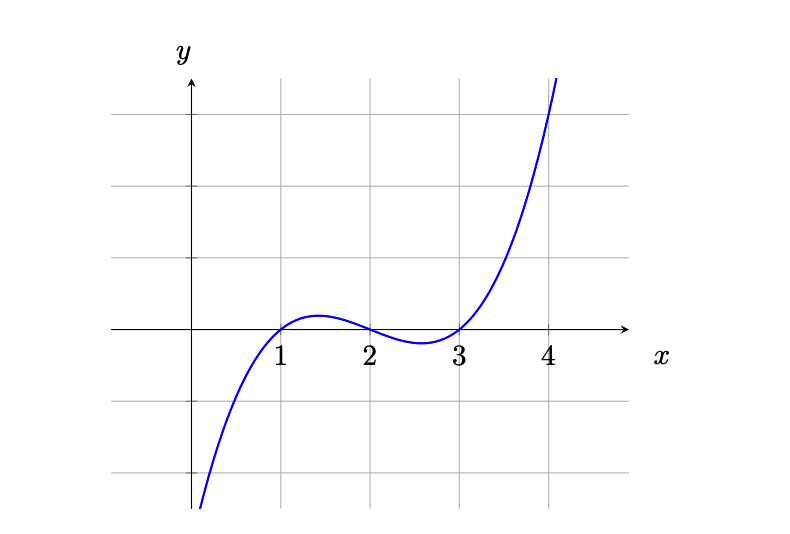
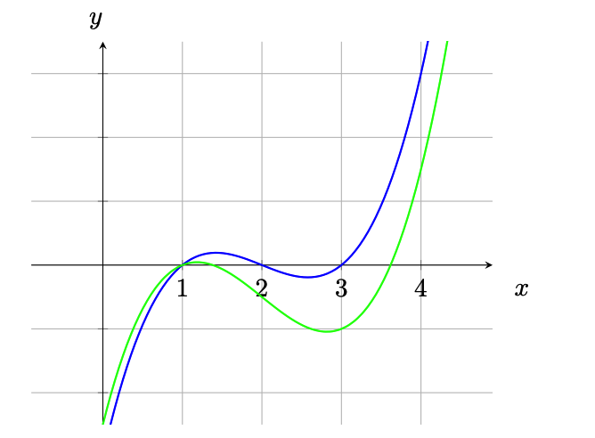

> 原文链接：https://arxiv.org/pdf/1906.07221

## 什么是零知识证明

zk-SNARK：Zero-knowledge succinct non-interactive arguments of knowledge（零知识简洁非交互式知识论证）；

可以在不揭示任何信息的前提下证明某个判断是否为真，可以运用的场景比如：

1. 证明关于隐私数据的声明：
    * A的账户余额多于X金额
    * B的信用评分高于X分数
2. 匿名认证：
    * 证明用户C来自合约国家白名单列表中一个国家，但不暴露具体是哪个
3. 匿名支付：
    * 付款完全脱离任何一种身份
    * 纳税，但不透露收入
4. 外包计算：
    * 将计算外包，并且不重新执行的情况下验证结果是否正确
    * 区块链改进，原来是所有节点做同样的计算，可以改进为一个节点计算，其他节点只需要验证

在一个零知识证明系统当中，都要有一个` prover `在不泄漏任何额外信息的前提下要让` verifier `确信某些` statement `是正确的；

例如，` verifier `只能知道` prover `的账户余额多于X，但不知道具体余额；

## 证明的媒介

### 位数组

想象有一个长度为10的位数组，现在要向` verifier `证明这样一个` statement `：所有位都被设置成了1；

` verifier `一次只能检查一位：` X = [?],[?],[?],[?],[?],[?],[?],[?],[?],[?] `；

为了验证这个` statement `，可以以某种任意的顺序读取元素并检查其是否确实等于1，如果抽样检查的结果是1，则` statement `的可信度为10%，否则，如果结果是0，则说明` statement `是错误的；` verifier `可以一直持续这个操作，直到获得足够的可信度为止；

如果一些场景需要50%的可信度，那么必须执行5次校验；如果需要95%的可信度，那么必须检查所有元素；很明显这个协议的缺点是必须要根据元素的数量进行检查，如果数据有百万个，这么做是不现实的；

### 多项式

多项式可以在坐标系上被画成一条曲线:

上面的曲线对应的多项式是（3阶多项式）:
$$
f(x) = x^3 - 6x^2 + 11x - 6
$$
多项式有个非常好的特性，就是如果我们有两个阶数为d的不相等多项式，它们相交的点数不会超过d个；比如:

绿色线的多项式是:
$$
f(x) = x^3 - 6x^2 + 10x - 5
$$
仅仅是修改了最后两个子式的系数，就产生了变化很大的曲线；

并且，我们不可能找到两条不同的曲线在某些区域内重合，只会相交于一点；

如果要查找两个多项式的交点，只需要令它们相等，比如:
$$
x^3 - 6x^2 + 11x - 6 = x^3 - 6x^2 + 10x - 5\\
x - 1 = 0\\
x = 1\\
$$
所以上面两个多项式有一个交点(1, 0)；

任意一个由阶数为d的多项式组成的等式，最后都会被化简为另外一个阶数至多为d的多项式，并且至多有d个解，也就是至多有d个共同点；

**所以，就可以理解为，任何多项式在任意点的计算结果，都可以看成是这个多项式唯一身份的标识**；

现在就可以根据多项式的性质，做出一个简单协议来验证"一个` prover `声称他知道一些` verifier `也知道的多项式":

* ` verifier `选择一个随机值x并在本地计算多项式的结果
* ` verifier `将x值给到` prover `，并让` prover `计算他知道的多项式结果
* ` prover `代入x计算结果，并将结果给到` verifier `
* ` verifier `检查本地的计算结果和` prover `的计算结果是否相等，如果相等，那就说明` prover `的` statement `具有较高的可信度

如果把x的取值范围放到很大，比如1-$10^77$，那么计算结果不同的点的数量就有$10^77 - d$个，撞到相同点点概率就为:
$$
\frac{d}{10^{77}}
$$
现在的协议与第一种的位数组的方法相比，只需要一轮验证就可以让` statement `具有非常高的可信度，只要d远小于x的取值范围上限，就几乎是100%；

> 综上，由于我们不可能找到共享连续段的两条不相等多项式曲线，所以多项式的任意点可以看作为这个多项式的唯一身份表示；
>
> 也就是说，只要能证明多项式上的某个随机点，就可以证明这个多项式；
>
> 并且还可以拓展到多变量的多项式，也就是在一个多维空间内形成一个曲面；
>
> 所以，多项式是zk-SNARK相对核心的一个部分。

## 多项式的非交互式零知识证明

### 证明多项式的"知识"

目前为止，我们的协议还只是一个很弱的证明，因为协议中并没有任何措施去保证参与方必须按照协议的规则生成证明，所以双方只能互相信任；

比如，` prover `并不需要知道多项式，也能通过其他方式得到答案，或者，要是x的取值范围不够大，` prover `完全可以猜出答案；

**所以我们得想一想，"知道了多项式"意味着什么？**

一个多项式可以用下面的形式来表达:
$$
c_nx^n + c_{n-1}x^{n-1} + ... + c_1x^1 + c_0x^0
$$
一个人说他知道一个多项式，就代表着，他**知道这个多项式的所有系数**；

### 因式分解

代数的基本定理表面了，任意一个多项式只要它有解，就可以将它分解成线性多项式:
$$
(x - a_0)(x - a_1)...(x - a_n) = 0
$$
` prover `说他知道一个阶数为3，其中两个根分别是1和2的多项式，也就是说，这个多项式的形式为:
$$
(x - 1)(x - 2)(x - ??)
$$
因此，如果` prover `想要在不揭示多项式的前提下证明他的多项式确实有这两个根，那么他就得去证明他的多项式` P(x) `是` t(x) = (x - 1)(x - 2) `和任意多项式` h(x) = (x - ??) `的乘积，也就是` P(x) = t(x) * h(x) `；

我们需要证明的东西就是，存在一些多项式` h(x) `，能够使目标多项式` t(x) `与之相乘等于` P(x) `；

算出` h(x) `的方式是直接相除:
$$
h(x) = \frac{P(x)}{t(x)}
$$
如果` P(x) `中不包含因式` t(x) `，那么相除就会有余数；

现在就可以根据这个性质来完善协议：

* 需要证明的东西：` prover `有个特定阶数的多项式` P(x) `，并且有已知根，可被构建成` t(x) `;

* ` verifier `挑选一个随机值r，计算目标多项式的值` t(r) `，并将随机值r发送给` prover `;
* ` prover `计算` h(x) = P(x) / t(x) `，并代入r对` P(r) `和` h(r) `进行求值，将结果` P(r) `和` h(r) `发给` verifier `;
* ` verifier `验证` P(r) = t(r) * h(r) `，如果相等，就意味着` t(x) `是` P(x) `的因式;

这样，` verifier `不需要知道` prover `的多项式的情况下，也能证明` prover `确实有这么一个多项式；

如果` prover `的多项式没有` statement `中说明的已知根，那么在计算` h(x) = P(x) / t(x) `时会有余数，从而导致最终结果不一致，但也有极低的概率能被整除，如果后面` verifier `要求` P(r) `和` h(r) `都必须是整数的话，这个极低概率的情况也不存在，证明会被直接拒绝；

但是这么要求的话，也会牵扯到` P(x) `，多项式的系数得是整数，对协议会产生极大的限制；（所以后面会有能够使余数不被整除的密码学原理-模运算）

但是这个协议还是会存在一些问题：

1. ` prover `可能并不知道他所声称的` P(x) `，他完全可以先算一下` t(r) `，然后随机选择一个` h(r) `值，这样` verifier `无论怎么算，都是成功的；
2. 由于` prover `知道了随机的点` ( r, t(r)*h(r) ) `，他可以构造出一个多项式，让这个多项式也有这个点；
3. 由于没有申明阶数，` prover `可以拿一个满足校验的更高阶数的多项式来通过校验；

### 模糊计算

协议的前2个问题都是由于暴露了原始值而导致的，也就是` prover `知道了` r `和` t(r) `；

但如果` verifier `给出的值` r `像放在黑盒中一样不可见的话就完美了，也就是一个人不破坏协议，也依然能在这些模糊的值上面完成计算；

有点类似哈希函数，结果很难回到原始值上面；

#### 同态加密

所以就有了同态加密，它允许加密一个值并在密文上进行算术运算；

获取加密的同态性质的方法有很多种，这边介绍一个简单的方法：选择一个自然数` g `，然后以要加密的值为指数对` g `进行求幂；

比如选取` g `为5，要对3进行加密:
$$
5^3 =125
$$
这里的125就是3对应的密文；

如果要对被加密的值乘2，我们可以以2为指数来对这个密文进行计算:
$$
125^2 = 15,625 = (5^3)^2 = 5^{2*3} = 5^6
$$
还可以通过密文相乘来使两个被加密的值相加:
$$
5^3 * 5^2 = 5^{3 + 2} = 5^5 = 3,125
$$
同样的，可以通过密文相除来使被加密的数字相减:
$$
\frac{5^5}{5^3} = 5^5 * 5^{-3} = 5^{5 - 3} = 5^2 = 25
$$
不过由于基数` g `5是公开的，很容易就可以找到被加密的数字，因为只要将密文不停的除5，直到结果为1，做除法的次数也就是被加密值的数；

#### 模运算

这里就到了模运算发挥作用的地方了，模运算就是对一个整数进行欧几里得触发获得余数，将结果限定在一个固定的范围内，通常用符号` mod `来表示；
$$
3 * 5 \equiv 3 \pmod{6}\\
5 + 2 \equiv 1 \pmod{6}
$$
并且，模运算还有个重要性质就是运算顺序无所谓，可以先做完所有操作再取模，也可以做一步操作取一次模:
$$
(2 * 4 - 1) * 3 \equiv 3 \pmod{6}\\
->(2 * 4) \equiv 2 \pmod{6}\\
->(2 - 1) \equiv 1 \pmod{6}\\
->(1 * 3) \equiv 3 \pmod{6}\\
$$
现在回到之前的话题，如果我们使用模运算，很难从运算结果再回到原始值，因为很多不同的组合会产生一个同样的运算结果；

没有模运算的话，计算结果会给找出原始值提供一些线索，有了模运算，既可以把信息隐藏起来，又可以保留常见的算术属性；

#### 强同态加密

再回到同态加密上，结合使用模运算，比如使用` mod 7 `，可以得到:
$$
5^1 \equiv 5 \pmod{7}\\
5^2 \equiv 4 \pmod{7}\\
5^3 \equiv 6 \pmod{7}\\
...
$$
并且，不同指数下运算得到了同样的结果:
$$
5^1 \equiv 5 \pmod{7}\\
5^5 \equiv 5 \pmod{7}\\
5^{11} \equiv 5 \pmod{7}\\
...
$$
并且同态性质都保留了下来:
$$
5^3 \equiv 5 \pmod{7}\\
(5^3)^2 \equiv 5^6 \equiv 6^2 \equiv 1 \pmod{7}\\
5^3 * 5^2 \equiv 5^5 \equiv 10^1 \equiv 3 \pmod{7}\\
$$
加入了模运算，就很难知道指数是多少了；事实上，如果模取的相当大，从运算结果推倒指数运算几乎不可行了（现代密码学很大程度上就是基于这个问题的"困难"）；

所以加密函数就是（` v `就是我们要加密的值）:
$$
E(v) = g^v \pmod{n}
$$

> 这个同态加密模式有一个限制，可以把一个加密值和一个未加密值相乘，但是不能将两个加密的值相乘或相除（因为有模运算，比如5 mod 7与25 mod 7结果相乘为5 * 4 = 20，5 * 25 mod 7的结果为6），也就是不能对加密值取幂；

#### 加密多项式

接下来就可以利用强同态加密来修改零知识协议来；

前面知道了，知道一个多项式，就是知道它的所有系数，那么一个多项式就可以被加密为:
$$
P(x) = c_3x^3 + c_2x^2 + c_1x^1 + c_0x^0\\
=>E(x^3)^{c_3} * E(x^2)^{c_2} * E(x^1)^{c_1} * E(x^0)^{c_0}\\
= (g^{x^3})^{c_3} * (g^{x^2})^{c_2} * (g^{x^1})^{c_1} * (g^{x^0})^{c_0} \pmod {n}
= g^{{c_3}x^3} * g^{{c_2}x^2} * g^{{c_1}x^1} * g^{{c_0}x^0} \pmod {n}
= g^{{c_3}x^3+{c_2}x^2+{c_1}x^1+{c_0}x^0} \pmod {n} \\
比如P(x) = x^3 - 3x^2 + 2x\ 加密后就为\ g^{x^3-3x^2+2x} \pmod {n}
$$
通过这些运算，就能获得多项式的加密计算结果，由于同态的性质，同一个多项式的加密运算在加密空间中始终是相同的；

#### 更新协议

要证明的东西：` prover `有个阶数为` d `的多项式` P(x) `，并且有已知根，可被构建成` t(x) `;

1. ` verifier `:

    * $$
        1.\ 取一个随机数r\\
        2.\ 指数\ i\ 取值为0,1,...,d\ 时分别计算对\ r\ 求幂的加密结果，也就是E(r^i) = g^{r^i}\\
        3.\ 代入\ r\ ，计算结果得到\ t(r)\ \\
        4.\ 将对\ r\ 求幂的加密结果提供给\ prover\ (第二步的结果，E(r^0)、E(r^1)...、E(r^d))\\
        $$

2. ` prover `:

    * $$
        1.\ 计算多项式h(x) = \frac{P(x)}{t(x)}\\
        2.\ 使用verifier提供的加密值E(r^0),E(r^1)...E(r^d)和系数c_0,c_1...c_d计算E(P(r))和E(h(r))\\
        3.\ E(P(r)) = E(r^0)^{c_0}*E(r^1)^{c_1}...E(r^d)^{c_d} = (g^{{r_0}})^{c_0}*(g^{{r_1}})^{c_1}...(g^{{r_d}})^{c_d}\\
        4.\ E(h(r))同理\\
        5.\ 将E(P(r))和E(h(r))的结果提供给verifier\\
        $$

3. ` verifier `:

    * $$
        校验是否E(P(r)) = E(h(r))^{t(r)}\\
        $$

这样` prover `并不知道任何关于随机值` r `的信息，就很难提出不合法但是能够匹配验证的计算结果；

下面来举个例子实际计算一下，` prover `知道` P(x) = x^3 - 3x^2 + 2x `，有两个已知根0和1，构建成` t(x) = x(x - 1) `；基数` g `取5，模取17；

` verifier `取随机数` r `为3，计算值:
$$
E(r^0) = g^{r^0} = 5^0 = 1\\
E(r^1) = g^{r^1} = 5^3 = 125\\
E(r^2) = g^{r^2} = 5^9 = 1953125\\
E(r^3) = g^{r^3} = 5^{27} = 7450580596923828125\\
t(r) = r^2 - r = 6\\
$$
` prover `利用加密结果进行计算:
$$
h(x) = (x - 2) \\
E(P(r)) = g^{P(r)} = g^{E(r^3)^{c_3}}*g^{E(r^2)^{c_2}}*g^{E(r^1)^{c_1}}*g^{E(r^0)^{c_0}} = (g^{{27}})^{1}*(g^{{9}})^{-3}*(g^{{3}})^{2}*(g^{{1}})^{0} = 5^6 = 15625 \\
E(h(r)) = g^{h(r)} = g^{E(r^1)^{1}} * g^{E(r^0)^{-2}} = (g^{{3}})^{1} * (g^{{1}})^{-2} = 5^{1} = 5 \\
$$
` verifier `验证结果:
$$
E(P(r)) \overset{?}{=} E(h(r))^{t(r)}\\
E(h(r))^{t(r)} = (5^{1})^{6} = 15625\\
E(P(r)) = 15625\\
验证通过\\
$$
但当前协议还是可以通过其他方式来伪造证明，比如` prover `只使用了部分加密值，其他的没有使用，这个在当前协议中是不能证明的；

