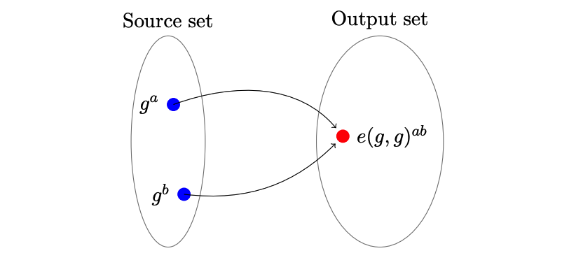

> 原文链接：https://arxiv.org/pdf/1906.07221

## 什么是零知识证明

zk-SNARK：Zero-knowledge succinct non-interactive arguments of knowledge（零知识简洁非交互式知识论证）；

可以在不揭示任何信息的前提下证明某个判断是否为真，可以运用的场景比如：

1. 证明关于隐私数据的声明：
    * A的账户余额多于X金额
    * B的信用评分高于X分数
2. 匿名认证：
    * 证明用户C来自合约国家白名单列表中一个国家，但不暴露具体是哪个
3. 匿名支付：
    * 付款完全脱离任何一种身份
    * 纳税，但不透露收入
4. 外包计算：
    * 将计算外包，并且不重新执行的情况下验证结果是否正确
    * 区块链改进，原来是所有节点做同样的计算，可以改进为一个节点计算，其他节点只需要验证

在一个零知识证明系统当中，都要有一个` prover `在不泄漏任何额外信息的前提下要让` verifier `确信某些` statement `是正确的；

例如，` verifier `只能知道` prover `的账户余额多于X，但不知道具体余额；

## 证明的媒介

### 位数组

想象有一个长度为10的位数组，现在要向` verifier `证明这样一个` statement `：所有位都被设置成了1；

` verifier `一次只能检查一位：` X = [?],[?],[?],[?],[?],[?],[?],[?],[?],[?] `；

为了验证这个` statement `，可以以某种任意的顺序读取元素并检查其是否确实等于1，如果抽样检查的结果是1，则` statement `的可信度为10%，否则，如果结果是0，则说明` statement `是错误的；` verifier `可以一直持续这个操作，直到获得足够的可信度为止；

如果一些场景需要50%的可信度，那么必须执行5次校验；如果需要95%的可信度，那么必须检查所有元素；很明显这个协议的缺点是必须要根据元素的数量进行检查，如果数据有百万个，这么做是不现实的；

### 多项式

多项式可以在坐标系上被画成一条曲线:

上面的曲线对应的多项式是（3阶多项式）:
$$
f(x) = x^3 - 6x^2 + 11x - 6
$$
多项式有个非常好的特性，就是如果我们有两个阶数为d的不相等多项式，它们相交的点数不会超过d个；比如:

绿色线的多项式是:
$$
f(x) = x^3 - 6x^2 + 10x - 5
$$
仅仅是修改了最后两个子式的系数，就产生了变化很大的曲线；

并且，我们不可能找到两条不同的曲线在某些区域内重合，只会相交于一点；

如果要查找两个多项式的交点，只需要令它们相等，比如:
$$
x^3 - 6x^2 + 11x - 6 = x^3 - 6x^2 + 10x - 5\\
x - 1 = 0\\
x = 1\\
$$
所以上面两个多项式有一个交点(1, 0)；

任意一个由阶数为d的多项式组成的等式，最后都会被化简为另外一个阶数至多为d的多项式，并且至多有d个解，也就是至多有d个共同点；

**所以，就可以理解为，任何多项式在任意点的计算结果，都可以看成是这个多项式唯一身份的标识**；

现在就可以根据多项式的性质，做出一个简单协议来验证"一个` prover `声称他知道一些` verifier `也知道的多项式":

* ` verifier `选择一个随机值x并在本地计算多项式的结果
* ` verifier `将x值给到` prover `，并让` prover `计算他知道的多项式结果
* ` prover `代入x计算结果，并将结果给到` verifier `
* ` verifier `检查本地的计算结果和` prover `的计算结果是否相等，如果相等，那就说明` prover `的` statement `具有较高的可信度

如果把x的取值范围放到很大，比如1-$10^77$，那么计算结果不同的点的数量就有$10^77 - d$个，撞到相同点点概率就为:
$$
\frac{d}{10^{77}}
$$
现在的协议与第一种的位数组的方法相比，只需要一轮验证就可以让` statement `具有非常高的可信度，只要d远小于x的取值范围上限，就几乎是100%；

> 综上，由于我们不可能找到共享连续段的两条不相等多项式曲线，所以多项式的任意点可以看作为这个多项式的唯一身份表示；
>
> 也就是说，只要能证明多项式上的某个随机点，就可以证明这个多项式；
>
> 并且还可以拓展到多变量的多项式，也就是在一个多维空间内形成一个曲面；
>
> 所以，多项式是zk-SNARK相对核心的一个部分。

## 多项式的非交互式零知识证明

### 多项式的"知识"是什么-系数

目前为止，我们的协议还只是一个很弱的证明，因为协议中并没有任何措施去保证参与方必须按照协议的规则生成证明，所以双方只能互相信任；

比如，` prover `并不需要知道多项式，也能通过其他方式得到答案，或者，要是x的取值范围不够大，` prover `完全可以猜出答案；

**所以我们得想一想，"知道了多项式"意味着什么？**

一个多项式可以用下面的形式来表达:
$$
c_nx^n + c_{n-1}x^{n-1} + ... + c_1x^1 + c_0x^0
$$
一个人说他知道一个多项式，就代表着，他**知道这个多项式的所有系数**；

### 有已知根可以干什么-因式分解

代数的基本定理表面了，任意一个多项式只要它有解，就可以将它分解成线性多项式:
$$
(x - a_0)(x - a_1)...(x - a_n) = 0
$$
` prover `说他知道一个阶数为3，其中两个根分别是1和2的多项式，也就是说，这个多项式的形式为:
$$
(x - 1)(x - 2)(x - ??)
$$
因此，如果` prover `想要在不揭示多项式的前提下证明他的多项式确实有这两个根，那么他就得去证明他的多项式` P(x) `是` t(x) = (x - 1)(x - 2) `和任意多项式` h(x) = (x - ??) `的乘积，也就是` P(x) = t(x) * h(x) `；

我们需要证明的东西就是，存在一些多项式` h(x) `，能够使目标多项式` t(x) `与之相乘等于` P(x) `；

算出` h(x) `的方式是直接相除:
$$
h(x) = \frac{P(x)}{t(x)}
$$
如果` P(x) `中不包含因式` t(x) `，那么相除就会有余数；

现在就可以根据这个性质来完善协议：

* 需要证明的东西：` prover `有个特定阶数的多项式` P(x) `，并且有已知根，可被构建成` t(x) `;

* ` verifier `挑选一个随机值r，计算目标多项式的值` t(r) `，并将随机值r发送给` prover `;
* ` prover `计算` h(x) = P(x) / t(x) `，并代入r对` P(r) `和` h(r) `进行求值，将结果` P(r) `和` h(r) `发给` verifier `;
* ` verifier `验证` P(r) = t(r) * h(r) `，如果相等，就意味着` t(x) `是` P(x) `的因式;

这样，` verifier `不需要知道` prover `的多项式的情况下，也能证明` prover `确实有这么一个多项式；

如果` prover `的多项式没有` statement `中说明的已知根，那么在计算` h(x) = P(x) / t(x) `时会有余数，从而导致最终结果不一致，但也有极低的概率能被整除，如果后面` verifier `要求` P(r) `和` h(r) `都必须是整数的话，这个极低概率的情况也不存在，证明会被直接拒绝；

但是这么要求的话，也会牵扯到` P(x) `，多项式的系数得是整数，对协议会产生极大的限制；（所以后面会有能够使余数不被整除的密码学原理-模运算）

但是这个协议还是会存在一些问题：

1. ` prover `可能并不知道他所声称的` P(x) `，他完全可以先算一下` t(r) `，然后随机选择一个` h(r) `值，这样` verifier `无论怎么算，都是成功的；
2. 由于` prover `知道了随机的点` ( r, t(r)*h(r) ) `，他可以构造出一个多项式，让这个多项式也有这个点；
3. 由于没有申明阶数，` prover `可以拿一个满足校验的更高阶数的多项式来通过校验；

### 如何避免暴露原始值-模糊计算

协议的前2个问题都是由于暴露了原始值而导致的，也就是` prover `知道了` r `和` t(r) `；

但如果` verifier `给出的值` r `像放在黑盒中一样不可见的话就完美了，也就是一个人不破坏协议，也依然能在这些模糊的值上面完成计算；

有点类似哈希函数，结果很难回到原始值上面；

#### 同态加密

所以就有了同态加密，它允许加密一个值并在密文上进行算术运算；

获取加密的同态性质的方法有很多种，这边介绍一个简单的方法：选择一个自然数` g `，然后以要加密的值为指数对` g `进行求幂；

比如选取` g `为5，要对3进行加密:
$$
5^3 =125
$$
这里的125就是3对应的密文；

如果要对被加密的值乘2，我们可以以2为指数来对这个密文进行计算:
$$
125^2 = 15,625 = (5^3)^2 = 5^{2*3} = 5^6
$$
还可以通过密文相乘来使两个被加密的值相加:
$$
5^3 * 5^2 = 5^{3 + 2} = 5^5 = 3,125
$$
同样的，可以通过密文相除来使被加密的数字相减:
$$
\frac{5^5}{5^3} = 5^5 * 5^{-3} = 5^{5 - 3} = 5^2 = 25
$$
不过由于基数` g `5是公开的，很容易就可以找到被加密的数字，因为只要将密文不停的除5，直到结果为1，做除法的次数也就是被加密值的数；

#### 模运算

这里就到了模运算发挥作用的地方了，模运算就是对一个整数进行欧几里得触发获得余数，将结果限定在一个固定的范围内，通常用符号` mod `来表示；
$$
3 * 5 \equiv 3 \pmod{6}\\
5 + 2 \equiv 1 \pmod{6}
$$
并且，模运算还有个重要性质就是运算顺序无所谓，可以先做完所有操作再取模，也可以做一步操作取一次模:
$$
(2 * 4 - 1) * 3 \equiv 3 \pmod{6}\\
->(2 * 4) \equiv 2 \pmod{6}\\
->(2 - 1) \equiv 1 \pmod{6}\\
->(1 * 3) \equiv 3 \pmod{6}\\
$$
现在回到之前的话题，如果我们使用模运算，很难从运算结果再回到原始值，因为很多不同的组合会产生一个同样的运算结果；

没有模运算的话，计算结果会给找出原始值提供一些线索，有了模运算，既可以把信息隐藏起来，又可以保留常见的算术属性；

#### 强同态加密

再回到同态加密上，结合使用模运算，比如使用` mod 7 `，可以得到:
$$
5^1 \equiv 5 \pmod{7}\\
5^2 \equiv 4 \pmod{7}\\
5^3 \equiv 6 \pmod{7}\\
...
$$
并且，不同指数下运算得到了同样的结果:
$$
5^1 \equiv 5 \pmod{7}\\
5^5 \equiv 5 \pmod{7}\\
5^{11} \equiv 5 \pmod{7}\\
...
$$
并且同态性质都保留了下来:
$$
5^3 \equiv 5 \pmod{7}\\
(5^3)^2 \equiv 5^6 \equiv 6^2 \equiv 1 \pmod{7}\\
5^3 * 5^2 \equiv 5^5 \equiv 10^1 \equiv 3 \pmod{7}\\
$$
加入了模运算，就很难知道指数是多少了；事实上，如果模取的相当大，从运算结果推倒指数运算几乎不可行了（现代密码学很大程度上就是基于这个问题的"困难"）；

所以加密函数就是（` v `就是我们要加密的值）:
$$
E(v) = g^v \pmod{n}
$$

> 这个同态加密模式有一个限制，可以把一个加密值和一个未加密值相乘，但是不能将两个加密的值相乘或相除（因为有模运算，比如5 mod 7与25 mod 7结果相乘为5 * 4 = 20，5 * 25 mod 7的结果为6），也就是不能对加密值取幂；

#### 加密多项式

接下来就可以利用强同态加密来修改零知识协议来；

前面知道了，知道一个多项式，就是知道它的所有系数，那么一个多项式就可以被加密为:
$$
P(x) = c_3x^3 + c_2x^2 + c_1x^1 + c_0x^0\\
=>E(x^3)^{c_3} * E(x^2)^{c_2} * E(x^1)^{c_1} * E(x^0)^{c_0}\\
= (g^{x^3})^{c_3} * (g^{x^2})^{c_2} * (g^{x^1})^{c_1} * (g^{x^0})^{c_0} \pmod {n}
= g^{{c_3}x^3} * g^{{c_2}x^2} * g^{{c_1}x^1} * g^{{c_0}x^0} \pmod {n}
= g^{{c_3}x^3+{c_2}x^2+{c_1}x^1+{c_0}x^0} \pmod {n} \\
比如P(x) = x^3 - 3x^2 + 2x\ 加密后就为\ g^{x^3-3x^2+2x} \pmod {n}
$$
通过这些运算，就能获得多项式的加密计算结果，由于同态的性质，同一个多项式的加密运算在加密空间中始终是相同的；

#### 更新协议

要证明的东西：` prover `有个阶数为` d `的多项式` P(x) `，并且有已知根，可被构建成` t(x) `;

1. ` verifier `:

    * $$
        1.\ 取一个随机数r\\
        2.\ 指数\ i\ 取值为0,1,...,d\ 时分别计算对\ r\ 求幂的加密结果，也就是E(r^i) = g^{r^i}\\
        3.\ 代入\ r\ ，计算结果得到\ t(r)\ \\
        4.\ 将对\ r\ 求幂的加密结果提供给\ prover\ (第二步的结果，E(r^0)、E(r^1)...、E(r^d))\\
        $$

2. ` prover `:

    * $$
        1.\ 计算多项式h(x) = \frac{P(x)}{t(x)}\\
        2.\ 使用verifier提供的加密值E(r^0),E(r^1)...E(r^d)和系数c_0,c_1...c_d计算E(P(r))和E(h(r))\\
        3.\ E(P(r)) = E(r^0)^{c_0}*E(r^1)^{c_1}...E(r^d)^{c_d} = (g^{{r_0}})^{c_0}*(g^{{r_1}})^{c_1}...(g^{{r_d}})^{c_d}\\
        4.\ E(h(r))同理\\
        5.\ 将E(P(r))和E(h(r))的结果提供给verifier\\
        $$

3. ` verifier `:

    * $$
        校验是否E(P(r)) = E(h(r))^{t(r)}\\
        $$

这样` prover `并不知道任何关于随机值` r `的信息，就很难提出不合法但是能够匹配验证的计算结果；

下面来举个例子实际计算一下，` prover `知道` P(x) = x^3 - 3x^2 + 2x `，有两个已知根0和1，构建成` t(x) = x(x - 1) `；基数` g `取5，模取17；

` verifier `取随机数` r `为3，计算值:
$$
E(r^0) = g^{r^0} = 5^0 = 1\\
E(r^1) = g^{r^1} = 5^3 = 125\\
E(r^2) = g^{r^2} = 5^9 = 1953125\\
E(r^3) = g^{r^3} = 5^{27} = 7450580596923828125\\
t(r) = r^2 - r = 6\\
$$
` prover `利用加密结果进行计算:
$$
h(x) = (x - 2) \\
E(P(r)) = g^{P(r)} = g^{E(r^3)^{c_3}}*g^{E(r^2)^{c_2}}*g^{E(r^1)^{c_1}}*g^{E(r^0)^{c_0}} = (g^{{27}})^{1}*(g^{{9}})^{-3}*(g^{{3}})^{2}*(g^{{1}})^{0} = 5^6 = 15625 \\
E(h(r)) = g^{h(r)} = g^{E(r^1)^{1}} * g^{E(r^0)^{-2}} = (g^{{3}})^{1} * (g^{{1}})^{-2} = 5^{1} = 5 \\
$$
` verifier `验证结果:
$$
E(P(r)) \overset{?}{=} E(h(r))^{t(r)}\\
E(h(r))^{t(r)} = (5^{1})^{6} = 15625\\
E(P(r)) = 15625\\
验证通过\\
$$
但当前协议还是可以通过其他方式来伪造证明，比如` prover `只使用了部分加密值，其他的没有使用，这个在当前协议中是不能证明的；

### 如何限制prover的值选择

前面说到，多项式的知识其实就是它的各个阶数的系数的知识；现在的协议中，我们通过对随机数` r `的幂的加密值再进行求幂来对系数进行"赋值":
$$
E(r^i) = (g^r)^i,((g^r)是加密值)
$$
这样初步限制了` prover `对` r `的幂的选择($E(r^i)$)，但是这个限制并不是强制的，也就是，只要` prover `通过任何方法找到了满足下面等式的值$Z_p$和$Z_h$:
$$
Z_p = (Z_h)^{t(r)}
$$
再用这两个值代替公式中的` E(P(r)) `和` E(h(r)) `，并将其交给` verifier `；

**所以` verifier `需要能够证明` prover `给的值就是用给的加密值计算的**；

首先来看一个由一个变量和一个系数组成的一阶多项式:
$$
P(x) = cx
$$
对应的` r `的加密值为:
$$
E(r^0) = 1\\
E(r^1) = (g^r)^1 = g^r
$$
这里需要确保的是` prover `拿的就是` E(r^1) `而不是其他值，然后用这个值与系数` c `做同态相乘:
$$
E(P(r)) = E(r^1)^c = (g^r)^c
$$
解决这个问题的一种方法就是用另一个"变换"的加密值做同样操作，充当类似校验和Checksum的作用，以此确保结果是原始值的求幂值；

这个是通过` Knowledge-of-Exponent Assumption `来实现的，也可以简称` KEA `:

* ` Alice `有一个值` data `，她想要` Bob `对其进行任意指数的求幂，唯一的要求就是只能对` data `进行求幂，为了保证这一点，她需要:

    * $$
        1.\ 选择一个随机数\ m \\
        2.\ 计算\ data' = {data}^{m} \pmod {n} \\
        3.\ 提供一个元组\ (data, data')给\ Bob，然后让他对这两个值执行任意的求幂运算，返回结果元组\ (bdata,bdata') \\
        $$

* 因为` Bob `无法从元组` (data, data') `中提取随机数` m `的值（通过暴力破解也很难），那就可以推断` Bob `生成有效元组的唯一方法就是执行下面的步骤:

    * $$
        1.\ 选择一个值\ n \\
        2.\ 计算\ bdata = (data)^n\pmod{n} \\
        3.\ 计算\ bdata' = (data')^n\pmod{n} \\
        4.\ 返回\ (bdata, bdata') \\
        $$

* 有了返回的结果元组和自己选择的随机数` m `，` Alice `就可以验证等式:

    * $$
        1.\ (bdata)^m = bdata' \\
        2.\ ({data}^{n})^{m} = (data')^n \\
        3.\ {data}^{m*n} = (data^{m})^{n} \\
        $$

* 所以可以得到结论:

    * ` Bob `在元组的两个值的计算上都用了同一个指数` n `
    * ` Bob `只能用` Alice `原本的元组来保持` m `关系
    * ` Bob `知道自己的指数` n `，因为构造验证值` (bdata, bdata') `的唯一方式是用同一个指数
    * ` Alice `并不知道` Bob `的指数` n `，相反，` Bob `同样不知道指数` m `
    * 虽然` n `是被加密的，但它的可能取值范围并不足够大到保持其零知识的性质，后面解决

最后这个协议提供了一个证明给` Alice `，` Bob `确实是用她知道的某个值对` data `进行求幂的，而且他也不能做别的任何操作，不然会破坏关系；

在同态加密中，求幂是对被加密值进行乘法运算，可以应用到这个结构到前面那个一阶多项式中:

* ` verifier `选择随机数` r `和随机数` m `，然后提供令` x = r `的一阶及其转换的计算值元组:

    * $$
        (data, data') = (g^r, g^{mr})
        $$

* ` prover `代入系数` c `计算返回值元组:

    * $$
        (res, res') = (data^c, (data')^c) = ((g^r)^c,(g^{mr})^c) = (g^{cr}, g^{mcr})
        $$

* ` verifier `验证:

    * $$
        res^m \stackrel{?}{=} res' =>(g^{cr})^m \stackrel{?}{=} g^{mcr}
        $$

这个结构限制` prover `只能用` verifier `提供的加密的` r `来进行计算，因而` prover `只能将系数` c `赋给` verifier `提供的元组；

并且可以将这种方法拓展到多项式上，因为计算是先将每项的分配分开计算然后再"同态"的相加在一起的；

所以如果给定` prover `一个指数为` r `的幂以及它们的变换的加密值，他就可以计算原始和变换后的多项式，当然也必须要满足同样的校验；

对于阶数为` d `的多项式:

* ` verifier `

    * $$
        1.\ 提供加密值\ g^{r^0},g^{r^1}...g^{r^d}\\
        2.\ 以及对应的变换\ g^{mr^0},g^{mr^1}...g^{mr^d}\\
        3.\ 计算一下\ t(r)的结果\\
        $$

* ` prover `

    * $$
        1.\ 计算E(P(r)) = ({g^{r^0}})^{c_0}*({g^{r^1}})^{c_1}...({g^{r^d}})^{c_d} = g^{(c_0r^0 + c_1r^1 + ... + c_dr^d)}\\
        2.\ 计算对应的变换E(P'(r)) = ({g^{mr^0}})^{c_0}*({g^{mr^1}})^{c_1}...({g^{mr^d}})^{c_d} = g^{m(c_0r^0 + c_1r^1 + ... + c_dr^d)}\\
        3.\ 计算E(h(r))同理(E(h'(r))也可以提供，但没那个必要，有E(P'(r))就够了)\\
        4.\ 提供\ (E(P(r)), E(P'(r)))\ 和\ E(h(r))\\
        $$

* ` verifier `

    * $$
        1.\ 校验E(P(r))^m\ 是否等于\ E(P'(r))\\
        2.\ 校验E(P(r))\ 是否等于\ E(h(r))^{t(r)}\\
        $$

现在的协议就能够确保` prover `是用了` verifier `提供的多项式而不是其他值做计算的了，因为别的方法不能够保持变换关系；

### 如何来零知识证明

但是尽管已经做了加密，在` 零知识 `性质上也还依然存在一个很明显的缺陷：即理论上多项式的参数` c `有一个很广的取值范围，实际上这个范围可能很有限，这就意味着` verifier `可以在有限范围的系数组合中进行暴力破解，最终计算出一个与` prover `的答案相等的结果；

比如，将每个系数的取值范围定为100，多项式的阶数为2，那么大概会有$100^3$种不同的组合，只需要暴力破解少于100万次的迭代；

所以这方面还需要改进，即使在只有一个系数，` c `的值仅为1的例子中，协议也应该能够保证其安全。

` verifier `提供的数据:
$$
E(P(r)),\ E(P'(r)),\ E(h(r))
$$
这些数据参与到了以下的一些验证:
$$
E(P(r)) = E(h(r))^{t(r)}\ ->\ 多项式P(x)有根t(x)\\
E(P(r))^{m} = E(P'(r))\ ->\ 是否使用了verifier提供的数据\\
$$

现在问题就是，` verifier `能够从` prover `发送的数据中提取未知多项式` P(x) `的知识；

我们如何选择证明，使得这个校验依旧有效，同时又保证没有知识能被提取？

前面的模糊计算部分给我们提示，可以使用随机值` δ(delta) `来变换这些值，如:
$$
E(P(r))\ ->\ E(P(r))^{\delta}
$$
现在，` verifier `为了提取知识，就必须首先知道` prover `提供的一个不可知的值` δ `，这种随机化在统计学上与随机值没什么区别；

为了保持这种关系，` prover `可以在计算的结果上加上` δ `幂，` verifier `最后的检查中，等式的两边都有` δ `幂，只要知道正确的知识，那么等式一定保持相等；

现在的协议就变成了这样，对于阶数为` d `的多项式:

* ` verifier `

    * $$
        1.\ 提供加密值\ g^{r^0},g^{r^1}...g^{r^d}\\
        2.\ 以及对应的变换\ g^{mr^0},g^{mr^1}...g^{mr^d}\\
        3.\ 计算一下\ t(r)的结果\\
        $$

* ` prover `

    * $$
        1.\ 计算E(P(r)) = ({g^{r^0}})^{c_0}*({g^{r^1}})^{c_1}...({g^{r^d}})^{c_d} = g^{(c_0r^0 + c_1r^1 + ... + c_dr^d)}\\
        2.\ 计算对应的变换E(P'(r)) = ({g^{mr^0}})^{c_0}*({g^{mr^1}})^{c_1}...({g^{mr^d}})^{c_d} = g^{m(c_0r^0 + c_1r^1 + ... + c_dr^d)}\\
        3.\ 计算E(h(r))同理(E(h'(r))也可以提供，但没那个必要，有E(P'(r))就够了)\\
        4.\ 选择一个随机数\delta\\
        5.\ 提供\ E(P(r))^{\delta}, E(P'(r))^{\delta}\ 和\ E(h(r))^{\delta}\\
        $$

* ` verifier `

    * $$
        1.\ 校验(E(P(r))^{\delta})^m\ 是否等于\ E(P'(r))^{\delta}\\
        2.\ 校验E(P(r))^{\delta}\ 是否等于\ (E(h(r))^{\delta})^{t(r)}\\
        $$

可以看到` 零知识 `可以轻而易举的融入到这个结构当中去，这通常也被称为"无成本的"零知识；

### 如何从交互式转为非交互式

现在我们已经有了一个交互式的零知识方案，感觉也挺好，但为什么还需要有非交互式的方案？

因为交互式的证明只对原始的` verifier `有效，其他任何人都不能够信任这个证明，因为:

* ` verifier `可以和` prover `串通，告诉他各种参数，有了参数就能伪造证明
* ` verifier `也可以使用同样的方法自己伪造证明，自导自演
* ` verifier `必须保存` m `和` t(r) `直到所有相关证明被验证完毕，这就带来了一个可能造成秘密参数泄漏的额外攻击面

这样` prover `就需要分别和每个` verifier `做交互来证明一个` statement `，这种方法明显很低效，` prover `需要一直保持在线，并且对每一个` verifier `执行相同的计算；

因此，**我们需要一个可以被重复使用，公开，可信，又不会被滥用的秘密参数**；

#### 同态加密的局限性

先思考一下，如何在构造出秘密值` ( t(r),m ) `之后保证它的安全性？

可以对其进行加密，方式就和` verifier `在发送加密值给` prover `之前对` r `的幂使用的加密方式一致；

* 可以加密:

    * $$
        E(v) = g^v\pmod{n}\\
        $$

* 可以加法:

    * $$
        E(a)*E(b) = E(a + b)\  ->\ g^a*g^b = g^{a + b}\\
        $$

* 可以与明文相乘:

    * $$
        E(a)^k = E(a * k)\ ->\ g^{a*k} = (g^a)^k\\
        $$

但是，我们所使用的同态加密方式并不支持两个加密值相乘，也就是给定` E(a) `和` E(b) `，无法计算` E(a*b) `；

但是` verifier `的检查需要乘法，就比如` P(x) = t(x) * h(x) `；

#### 加密值的相乘怎么解决

这个问题适合用` Pairing配对操作 `来解决；

配对操作（双线性映射）是一个数学结构，表示为函数` e(g, g) `，它给定一个数据集中的两个加密的输入（即` g^a `,` g^b `），可以将他们确定性地映射到另一组不同的输出数据集上的它们的乘积，即` e(g^a, g^b) = e(g, g)^ab `:

因为源数据集和输出数据集（通常被称为一个group）是不同的，所以一个配对的结果不能用做其他配对计算的输入，所以我们不能用另一个加密值乘以结果，而且配对这个名称本身也表明了，我们一次只能将两个加密值相乘；

有点像哈希函数，将所有可能的输入值映射到可能的输出值的集合中的一个元素上，并且这个过程是不可逆的；

看上去这个限制可能会阻碍相关功能的实现，但在zk-SNARK中，这反而是保证安全模式的最重要的性质；

配对函数` e(g, g) `可以初步地类比成"交换"每一个输出的基数和指数的操作，使得基数` g `在交换过程中被修改成了指数的方式，即` g^a -> a^g `；

"被转换"的两个输入一起被修改了，这样原始值` a `和` b `就在同一个指数下相乘了，也就是:
$$
e(g^a, g^b) = a^g * b^g = (ab)^g\\
$$
因为基数` g `在转换中被修改了，所以在另一个配对中不能再使用这个结果` (ab)^g `，也就是` e((ab)^g, g^c) `构造出想要的加密乘积` abc `了；

配对的核心性质可以表示成下面的等式:
$$
e(g^a, g^b) = e(g^b, g^a) = e(g^{ab}, g^1) = e(g^1, g^{ab}) = e(g^1, g^a)^b = e(g^1, g^1)^{ab} = ...
$$
严格来讲，一个配对的结果是在目标集的一个不同生成元` g `下对原始值乘积的加密，即` e(g^a, g^b) = g^ab `；

因此它具备同态加密的性质，也就是说我们可以把乘法配对的加密乘积放到一起:
$$
e(g^a, g^b) * e(g^c, g^d) = g^{ab}*g^{cd} = g^{ab + cd} = e(g, g)^{ab + cd}
$$

> 配对操作是通过改变椭圆曲线来实现这些性质的，现在我们用的符号` g^n `就代表曲线上一个由生成元自相加了n次的点，而不是我们前面用到的乘法群生成元；

#### 如何构建可信Setup

有了配对操作，现在就可以去设置公开且可复用的参数了；

假定让一个诚实的参与方来生成秘密值` r `和` m `，只有` m `和所有必要的` r `的幂及其对应的变换被加密了，那么这些原始数据就必须要被删除:
$$
g^m, g^{r^i}, g^{mr^{i}}
$$
这些参数通常被称为` common reference string `或者` CRS `；` CRS `生成后，任何的` prover `和任何的` verifier `都可以使用它来构造非交互式的零知识证明协议；

还可以优化一下，` CRS `的优化版本可以包含目标多项式的加密值:
$$
g^{t(r)}
$$
把` CRS `分成两组:

* ` proving key (evaluation key)`:

    * $$
        (g^{r^{i}}, g^{mr^{i}})
        $$

* ` verification key `:

    * $$
        (g^{t(r)}, g^m)
        $$

只要能够乘以加密值，` verifier `就可以在协议的最后一步验证多项式来:

* 有了` verification key `，` verifier `就可以处理从` prover `那里得到的加密多项式的值` E(P(r)) `，` E(P'(r)) `，` E(h(r)) `:

    * 在加密空间中校验` P = t * h `:

        * $$
            e(E(P(r)), g^1) = e(g^P, g^1) = e(g, g)^{P*1}\ 是否等于\ e(E(h(r)), E(t(r))) = e(g^h, g^t) = e(g, g)^{h * t}
            $$

    * 校验多项式的限制:

        * $$
            e(E(P(r)), g^m) = e(g^P, g^m) = e(g, g)^{mP}\ 是否等于\ e(E(P'(r)), g^1) = e(g^{P'}, g^1) = e(g, g)^{P'}
            $$

#### 如何构建多方可信Setup

尽管受信任Setup很有效率，但众多` CRS `用户也必须要相信生成这确实删除了` r `和` m `，这一点是没有办法证明的，所以这种方法依然是无效的；

很有必要去最小化或者消除这种信任，否侧一个不诚实的参与方就可以构造假证明而不被发现；

一种解决方法就是由多个参与方一起来生成一个组合式` CRS `，这样这些参与方就都不知道"秘密"了；

假设有3个参与方` Alice `，` Bob `，` Carol `，对应` A `，` B `，` C `:

* ` Alice `选择随机数` r_A `和` m_A `，然后公开她的` CRS `:

    * $$
        (g^{({r_A})^{i}}, g^{(m_A)}, g^{({m_A})({r_A}^i)})
        $$

* ` Bob `选择他的随机数` r_B `和` m_B `，然后通过同态乘法结合` Alice `的` CRS `，然后公开` CRS `结果:

    * $$
        ((g^{({r_A})^{i}})^{({r_B})^{i}}, (g^{(m_A)})^{(m_B)}, (g^{({m_A})({r_A}^i)})^{({m_B})({r_B}^i)}) = (g^{({r_Ar_B})^{i}}, g^{(m_Am_B)}, g^{({m_Am_B})({r_Ar_B}^i)})
        $$

* ` Carol `用她的随机数` r_C `和` m_C `做同样的事情，然后公开:

    * $$
        (g^{({r_Ar_Br_C})^{i}}, g^{(m_Am_Bm_C)}, g^{({m_Am_Bm_C})({r_Ar_Br_C}^i)})
        $$

这个方法最后就得到了一个混合的` r `和` m `:
$$
r^i = r_A^ir_B^ir_C^i\\
m = m_Am_Bm_C
$$
除非他们串谋，否则参与者们互相之间并不知道其他人的秘密参数；

**实际上，一个参与者必须要和其他所有的参与者串谋，才能得到最终的` r `和` m `，这样在所有的参与者中，只要有一个是诚实的，就没有办法伪造证明，并且这个过程还可以被尽可能多的参与者重复完成**；

还有一个问题是，如何验证参与者在生成` CRS `时用的随机数值是正确的，因为攻击者可以生成多个不同的随机数` r_1 `，` r_2 `...和` m_1 `，` m_2 `...，然后代入这些不同的随机数去执行` r `的不同次幂计算，从而使得` CRS `无效或者不可用；

这个解决很简单，因为我们可以使用配对操作来乘以加密值，所以我们就可以从第一个参数开始逐一执行一致性校验，确保了每个参数都源于前一个；

* 用` r `的1次幂作为标准来校验每一个其他次幂的值与之是否保持一致:

* $$
    e(g^{r^i}, g) = e(g^{r^1}, g^{r^{i - 1}})
    $$

* 例如:

* $$
    2次幂:\ e(g^{r^2}, g) = e(g^{r^1}, g^{r^1}) => e(g, g)^{r^2} = e(g, g)^{r^{1 + 1}}\\
    3次幂:\ e(g^{r^3}, g) = e(g^{r^1}, g^{r^2}) => e(g, g)^{r^3} = e(g, g)^{r^{1 + 2}}\\
    $$

* 还可以验证变换后的值是否正确:

* $$
    e(g^{r^i}, g^m) = e(g^{mr^i}, g)
    $$

* 例如:

* $$
    3次幂:\ e(g^{r^3}, g^m) = e(g^{mr^3}, g) => e(g, g)^{r^3*m} = e(g, g)^{mr^3}
    $$

当我们在验证每一个参与者秘密参数的一致性时，要注意参与者生成` CRS `的过程并没有强制后一个参与者（也就是例子中的` Bob `和` Carol `）都要使用前面已经公开的` CRS `；

因此，如果一个攻击者是链上的最后一个参与者，他可以像链上的第一个参与者一样忽略前面的` CRS `随便构造一个有效的` CRS `，这样他就变成了唯一一个知道秘密` r `和` m `的人；

为了解决这个问题，我们可以额外再要求除了第一个以外的每一个参与者去加密然后公开他的参数；

例如，` Bob `同样公开了:
$$
(g^{({r_B})^{i}}, g^{(m_B)}, g^{({m_B})({r_B}^i)})
$$
这就可以去验证` Bob `的` CRS `是乘以了` Alice `的参数后正常获得的:
$$
e(g^{r_{AB}^i}, g) = e(g^{r_A^i}, g^{r_B^i})\\
e(g^{m_{AB}^i}, g) = e(g^{m_A}, g^{m_B})\\
e(g^{m_{AB}*r_{AB}^{i}}, g) = e(g^{m_Ar_A^i}, g^{m_Br_B^i})
$$
同样的，` Carol `也必须证明她的` CRS `是乘以了` Alice-Bob `的` CRS `后正常获得的；

这样才是一个健壮的` CRS `设置模式，它并不完全依赖于单个参与者，而且，即使其他所有的参与者都串谋了，只要有一个新的参与者是诚实的，他能够删除并且永远不共享它的秘密参数，这个` CRS `就是有效的；

所以在设置` CRS `时，有越多不相关的参与者参与，伪造证明的可能性就越低；

当有互相竞争的参与方参与时，就几乎不可能伪造证明了；

这种模式能够包容其他一些怀疑这种` Setup `可识别性的不受信方，因为校验步骤确保了他们不会破坏最终的` CRS `；

现在有一些` zk-SNARK `方案支持可升级的` CRS `，任何怀疑` CRS `的参与方都可以对` CRS `进行更新；此外，还有一些` zk-SNARK `方案支持` Universal CRS `，不需要对每一个电路进行受信任` Setup `，而是只需要全局完成一次即可；

### 多项式的zk-SNARK

经过上面的逐步升级，就可以有一个完整版的` zk-SNARK `协议；

#### 完整协议

对于` prover `有个阶数为` d `的多项式` P(x) `，并且有已知根，可被构建成` t(x) `:

* ` Setup `:

    * $$
        1.\ 挑选随机值\ r\ 和\ m\ \\
        2.\ 计算加密值\ g^m\ 和\ \left\{ g^{r^i} \right\}_{i \in [d]}\ 和\ \left\{ g^{mr^i} \right\}_{i \in \left\{ 0,...,d \right\}}\\
        3.\ 生成proving\ key:(\left\{ g^{r^i} \right\}_{i \in [d]}, \left\{ g^{mr^i} \right\}_{i \in \left\{ 0,...,d \right\}})\\
        4.\ 生成verification\ key:(g^m, g^{t(r)})\\
        $$

* ` Proving `:

    * $$
        1.\ 分配系数(知识)\left\{ c_i \right\}_{i \in \left\{ 0,...,d \right\}}得到P(x) = c_dx^d + ... + c_1x^1 + c_0x^0\\
        2.\ 求多项式h(x) = \frac{P(x)}{t(x)}\\
        3.\ 代入\left\{ g^{r^i} \right\}_{i \in [d]}计算多项式\ g^{P(r)}\ 和\ g^{h(r)}\ 的值\\
        4.\ 代入\left\{ g^{mr^i} \right\}_{i \in [d]}计算变换多项式\ g^{mP(r)}\ 的值\\
        5.\ 选择随机数\delta\\
        6.\ 构造随机化的证明\pi = (g^{\delta P(r)}, g^{\delta h(r)}, g^{\delta mP(r)})
        $$

* ` Verification `:

    * $$
        1.\ 映射证明\ \pi\ 为\ (g^{P}, g^h, g^{P'})\\
        2.\ 验证多项式约束:\ e(g^{P'}, g)\ 是否等于\ e(g^P, g^m)\ \\
        3.\ 验证多项式系数:\ e(g^P, g)\ 是否等于\ e(g^{t(r)}, g^{h})\\
        $$

#### 实例演示

` Prover `有一个3阶多项式` P(x) = x^3 - 3x^2 + 2x `，并且他宣传他知道两个根0和1，也就是` t(x) = x(x - 1) `:

> 基数` g `取5，模取17，随机数` r `取3，随机数` m `取7，随机数` δ `取11

* ` Setup `:

    * $$
        1.\ 计算\ t(r) = r(r-1) = 3*2 = 6\\
        2.\ 计算\ g^{t(r)} = 5^6\pmod{17} = 2\\
        3.\ 计算\ g^m\pmod{17} = 5^7\pmod{17} = 10\\
        4.\ 计算\ \left\{ g^{r^i} \right\}_{i \in [d]}\ \\
        g^{r^0} \pmod{17} = g^{3^0} \pmod{17} = 5^1 \pmod{17} = 5\\
        g^{r^1} \pmod{17} = g^{3^1} \pmod{17} = 5^3 \pmod{17} = 6\\
        g^{r^2} \pmod{17} = g^{3^2} \pmod{17} = 5^9 \pmod{17} = 12\\
        g^{r^3} \pmod{17} = g^{3^3} \pmod{17} = 5^27 \pmod{17} = 11\\
        5.\ 计算\ \left\{ g^{mr^i} \right\}_{i \in \left\{ 0,1,2,3 \right\}} \\
        g^{mr^0} \pmod{17} = g^{7*3^0} \pmod{17} = 5^7 \pmod{17} = 10\\
        g^{mr^1} \pmod{17} = g^{7*3^1} \pmod{17} = 5^21 \pmod{17} = 14\\
        g^{mr^2} \pmod{17} = g^{7*3^2} \pmod{17} = 5^63 \pmod{17} = 7\\
        g^{mr^3} \pmod{17} = g^{7*3^3} \pmod{17} = 5^189 \pmod{17} = 3\\
        6.\ 生成Proving\ Key\ -->\ (\left\{ 5,6,12,11 \right\}, \left\{ 10,14,7,3 \right\})\\
        7.\ 生成Verification\ Key\ -->\ (g^m, g^{t(r)}) = (10, 2)\\
        $$

* ` Proving `:

    * $$
        1.\ 系数c_3 = 1,c_2 = -3,c_1 = 2,c_0 = 0\\
        2.\ 计算g^{P(r)} = 5^{27-27+6}\pmod{17} = 5^6\pmod{17} = 2\\
        3.\ h(x) = x - 2, h(r) = 3 - 2 = 1, 阶数为1,系数为1和-2,要用到g^{r^1} = 6和g^{r^0} = 5\\
        4.\ 计算(与计算g^P不同的另一种方法)g^{h(r)} = (g^{r^1})^1*(g^{r^0})^{-2} \pmod{17} = 6*5^{-2}\pmod{17} = 6*8^{-1}\pmod{17}\\
        8^{-1}\pmod{17} = 15(因为8*15 = 120 = 7*17+1)\\
        g^{h(r)} = 6*15\pmod{17} = 5\\
        5.\ 计算g^{mP(r)} = 5^{7*6}\pmod{17} = 9\\
        [也可以这样，指数6*7=42需要mod 16，指数世界mod需要减1，也能得到10，5^10 mod 17 = 9]\\
        6.\ 应用零知识随机化\delta=11，\pi = (g^{\delta P(r)}, g^{\delta h(r)}, g^{\delta mP(r)}) = (2^{11}, 5^{11}, 9^{11})\pmod {17} = (8, 11, 15)\\
        $$

* ` Verification `:

    * $$
        1.\ verifier只知道\pi\ -->\ (g^{P}, g^h, g^{P'}) = (g^{\delta P(r)}, g^{\delta h(r)}, g^{\delta mP(r)}) = (8, 11, 15)\\ 
        以及\ Verification\ Key\ -->\ (g^m, g^{t(r)}) = (10, 2)\\
        2.\ e(g^{P'}, g)\ 是否等于\ e(g^P, g^m)\\
        左边\ e(g^{P'}, g) = e(15, g) = e(g, g)^{\log_g 15} = e(g, g)^14\\
        [如何需要找\log_5 15\pmod{17}\ ->\ 5^{14} \pmod{17} = 15 -> \log_5 15\pmod{17} = 14]\\
        右边\ e(g^P, g^m) = e(8, 10) = e(g, g)^{\log_g 8*\log_g 10} = (同样方法) = e(g, g)^{2*7} = e(g, g)^{14}\\
        左边\ ==\ 右边\\
        3.\ e(g^P, g)\ 是否等于\ e(g^{t(r)}, g^{h})\\
        左边\ e(g^P, g) = e(8, g) = e(g, g)^{\log_g 8} = e(g, g)^2\\
        右边\ e(g^{t(r)}, g^{h(r)}) = e(2, 11) = e(g, g)^{\log_g 2 * \log_g 11} = e(g, g)^{6*11} = e(g, g)^{66 \pmod {17-1}} = e(g, g)^2\\
        左边\ ==\ 右边\\
        $$

### 结论

> 梳理一下一步一步都解决了什么问题：
>
> 1. 多项式的知识是什么 -> 系数
> 2. 多项式已知一些系数，可以干什么 -> 因式分解得到子多项式
> 3. 初步能证明后，但是协议有风险，会暴露原始值 -> 模糊计算（同态加密、取模）
> 4. 如何保证` prover `的证明是按规则正确构造的 -> ` KEA `，选择一个随机值` m `求幂后，再校验
> 5. 如何保证知识的零知性 -> 使用无成本的` δ `来变换，使等式两边相等
> 6. 如何低成本的使用可复用证明 -> 从交互式变成非交互式
> 7. 非交互式中如何设置安全且公开的Setup -> 参数加密，使用配对操作对加密值相乘及验证
> 8. 非交互式中如何确保参与方删除了秘密值 -> 使用多方可信Setup

至此，一个用来证明多项式知识的完整` zk-SNARK `协议就构建出来了；

不过这是一个很有局限的例子，因为完全可以说` prover `只要用另外一个有界的多项式去乘以` t(x) `就可以轻松构造出一个能够通过测试的多项式` P(x) `，并且这种结构也是有效的；

` verifier `知道` prover `有一个有效的多项式，但是并不知道是哪一个，除了这些，还可以利用多项式的其他性质添加额外的证明，比如：被多个多项式整除、是某个多项式的平方；虽然可能会有一个服务能够接受，存储和奖励所有经过证明的多项式，或者有一个需求，加密计算某种形式的未知多项式；

但是，若有一个像这样基础的通用方案，就可以支撑无数的应用；

